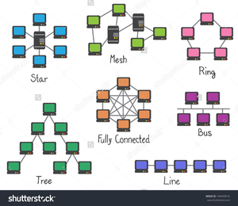

# 2. Канальный уровень (data link)

*   **Тип данных:** биты / кадры (фреймы)
*   **Назначение:** физическая адресация (понимать, кто с кем "общается"), разрешение коллизий (когда много участников "говорят" одновременно)
*   **Примеры:** Ethernet, PPP, DSL
*   **Действующие "лица"**: MAC-адрес,сетевая карта, коммутатор (switch)

Мы умеем передавать и принимать биты на физическом уровне. Теперь нужно научиться передавать и принимать их так, чтобы понимать, что вот этот набор бит - это чье-то сообщение, а вот этот - это незаконченный кусок сообщения (и надо получать еще биты). А еще нужно научиться разрешать ситуацию, когда несколько участников сети начинают вещать одновременно и их сообщения перекрывают друг друга (договориться о какой-то очередности). Сейчас чаще всего используется протокол Ethernet, про него и будем дальше говорить.

### Ethernet

Единица, которой оперирует Ethernet, называется **кадр, или фрейм**. Это набор байт определенной структуры, который содержит в себе полезные данные протоколов верхних уровней и служебную информацию. Существует несколько разных форматов, сейчас чаще всего используется такой:

1. Преамбула - 7 одинаковых байт **10101010** 
2. Начало кадра (Start of frame Delimiter) - 1 байт **10101011**
3. MAC-адрес получателя (destination) - 6 байт
4. MAC-адрес отправителя (source) - 6 байт
5. Длина - 2 байта
6. Данные - от 46 до 1500 байт (размер указан в предыдущем поле)
7. FCS (frame check sequence), контрольная сумма для проверки целостности - 4 байта

Сетевая карта при получении преамбулы и байта "начало кадра" понимает, что сейчас придет пакет (**пакет ethernet** - это все кроме преамбулы и FCS), считывает остальное (два адреса, длину, данные этой длины), вычисляет контрольную сумму по алгоритму CRC из полученного, сравнивает полученную сумму с FCS (для контроля ошибок) и если сумма совпала с FCS, то считает фрейм успешно принятым и отправляет пакет дальше в операционную систему или куда-то еще. Если значения не совпали, значит при при передаче что-то произошло: помехи, или кто-то вмешался в передачу, тогда фрейм считается поврежденным и выкидывается, а ОС вообще не знает о том, что что-либо произошло.

**MAC-адрес** (_Media Access Control_ — управление доступом к среде, также **Hardware Address**) - это комбинация из 6 байт, уникальная (ну, по задумке) для каждой единицы активного сетевого оборудования (сетевые карты, свитчи, роутеры). Обычно записывается в виде байт через двоеточия, например **F4:B7:E2:E9:4C:65**. У хабов нет MAC-адреса. Прошивается на заводе. У современного оборудования можно менять на любой. Участники сети, общающиеся с помощью Ethernet, различают друг друга по этим адресам. Сетевая карта, читающая фрейм, смотрит на поле destination, и если оно не совпадает с ее собственным адресом, выкидывает, потому что фрейм предназначается кому-то другому. Можно перевести сетевую карту в **неразборчивый (promiscuous) режим**, тогда она будет принимать все фреймы, даже не адресованные ей - это полезно при прослушивании и анализе сетевого трафика. При отправке сетевая карта пишет в поле source свой адрес. Как при отправке узнать destination, разберем позже.

Уникальность адреса при изготовлении оборудования обеспечивается тем, что производители получают в координирующем комитете IEEE Registration Authority диапазон из шестнадцати миллионов (224) адресов, и по мере исчерпания выделенных адресов могут запросить новый диапазон. Поэтому по трем старшим (первым) байтам MAC-адреса можно определить производителя. Существуют таблицы, позволяющие определить производителя по MAC-адресу.

Есть специальный MAC-адрес **FF:FF:FF:FF:FF:FF**, который означает, что пакет предназначен всем, кто его получит (**широковещательный адрес, broadcast**). Такие пакеты нужны для работы некоторых протоколов. Об этом позже.

Ethernet придумывался во времена, когда основной средой передачи были коаксиальные кабели, рассчитанные на подключение многих устройств к одному кабелю, поэтому в него встроены технологии определения коллизий - когда два или более устройств начинают передавать данные одновременно. Это похоже на ситуацию, когда в многолюдной комнате начинают говорить сразу двое, и невозможно разобрать, что говорит каждый из них. Технология называется CSMA/CD (Carrier Sense Multiple Access with Collision Detection) и сейчас нужна в основном для ситуаций, когда на одном проводе через хаб подключено несколько компьютеров. Вкратце, сетевая карта постоянно проверяет, не передает ли кто-то данные, если нет - то передает 1 бит, снова проверяет не передал ли кто-то свои данные, передает 1 бит и т.д., если кто-то вмешался в передачу - посылает специальный сигнал, означающий обнаружение коллизии (**jam-сигнал**), засыпает на случайное время и начинает сначала. Устройства, получившие jam-сигнал, выкидывают недочитанный фрейм и ждут начала нового фрейма. Если на одном проводе подключено много устройств и все пытаются передавать данные, большую часть времени они будут проводить, сталкиваясь коллизиями и ожидая освобождения канала, поэтому рекомендуется не использовать хабы вообще.

### Коммутаторы / свитчи

На втором уровне работают коммутаторы (свитчи) - устройства, позволяющие объединить много других устройств в одну сеть без коллизий. Обычно у коммутатора десятки портов и нет настроек, хотя бывают управляемые коммутаторы, которые умеют анализировать получаемые данные и что-то с ними делать. Коммутаторы значительно быстрее роутеров в смысле передачи пакетов от устройства к устройству и вносят совсем незначительную задержку. Дальше - статья с википедии практически целиком, необязательно, но, думаю, интересно.

#### Принцип работы коммутатора

Коммутатор хранит в памяти таблицу коммутации, в которой указывается соответствие MAC-адреса узла порту коммутатора. При включении коммутатора эта таблица пуста, и он работает в режиме обучения. В этом режиме поступающие на какой-либо порт данные передаются на все остальные порты коммутатора. При этом коммутатор анализирует фреймы (кадры) и, определив MAC-адрес хоста-отправителя, заносит его в таблицу на некоторое время. Впоследствии, если на один из портов коммутатора поступит кадр, предназначенный для хоста, MAC-адрес которого уже есть в таблице, то этот кадр будет передан только через порт, указанный в таблице. Если MAC-адрес хоста-получателя не ассоциирован с каким-либо портом коммутатора, то кадр будет отправлен на все порты, за исключением того порта, с которого он был получен. Со временем коммутатор строит таблицу для всех активных MAC-адресов, в результате трафик локализуется.

Существует три способа коммутации. Каждый из них — это комбинация таких параметров, как время ожидания и надежность передачи.

#### Режимы коммутации

*   С промежуточным хранением (Store and Forward). Коммутатор читает всю информацию в кадре, проверяет его на отсутствие ошибок, выбирает порт коммутации и после этого посылает в него кадр.
*   Сквозной (cut-through). Коммутатор считывает в кадре только адрес назначения и после выполняет коммутацию. Этот режим уменьшает задержки при передаче, но в нем нет метода обнаружения ошибок.
*   Бесфрагментный (fragment-free) или гибридный. Этот режим является модификацией сквозного режима. Передача осуществляется после фильтрации фрагментов коллизий (первые 64 байта кадра анализируются на наличие ошибки и при ее отсутствии кадр обрабатывается в сквозном режиме).

Задержка, связанная с «принятием коммутатором решения», добавляется к времени, которое требуется кадру для входа на порт коммутатора и выхода с него, и вместе с ним определяет общую задержку коммутатора.

#### Симметричная и асимметричная коммутация

Свойство симметрии при коммутации позволяет дать характеристику коммутатора с точки зрения ширины полосы пропускания для каждого его порта. Симметричный коммутатор обеспечивает коммутируемые соединения между портами с одинаковой шириной полосы пропускания, например, когда все порты имеют ширину пропускания 10 Мб/с или 100 Мб/с.

Асимметричный коммутатор обеспечивает коммутируемые соединения между портами с различной шириной полосы пропускания, например, в случаях комбинации портов с шириной полосы пропускания 10 Мб/с или 100 Мб/с и 1000 Мб/с.

Асимметричная коммутация используется в случае наличия больших сетевых потоков типа клиент-сервер, когда многочисленные пользователи обмениваются информацией с сервером одновременно, что требует большей ширины пропускания для того порта коммутатора, к которому подсоединен сервер, с целью предотвращения переполнения на этом порте. Для того, чтобы направить поток данных с порта 100 Мб/с на порт 10 Мб/с без опасности переполнения на последнем, асимметричный коммутатор должен иметь буфер памяти.

Асимметричный коммутатор также необходим для обеспечения большей ширины полосы пропускания каналов между коммутаторами, осуществляемых через вертикальные кросс-соединения, или каналов между сегментами магистрали.

#### Буфер памяти

Для временного хранения фреймов и последующей их отправки по нужному адресу, коммутатор может использовать буферизацию. Буферизация может быть также использована в том случае, когда порт пункта назначения занят. Буфером называется область памяти, в которой коммутатор хранит передаваемые данные.

Буфер памяти может использовать два метода хранения и отправки фреймов: буферизация по портам и буферизация с общей памятью. При буферизации по портам пакеты хранятся в очередях (queue), которые связаны с отдельными входными портами. Пакет передается на выходной порт только тогда, когда все фреймы, находившиеся впереди него в очереди, были успешно переданы. При этом возможна ситуация, когда один фрейм задерживает всю очередь из-за занятости порта его пункта назначения. Эта задержка может происходить даже в том случае, когда остальные фреймы могут быть переданы на открытые порты их пунктов назначения.

При буферизации в общей памяти все фреймы хранятся в общем буфере памяти, который используется всеми портами коммутатора. Количество памяти, отводимой порту, определяется требуемым ему количеством. Такой метод называется динамическим распределением буферной памяти. После этого фреймы, находившиеся в буфере, динамически распределяются по выходным портам. Это позволяет получить фрейм на одном порте и отправить его с другого порта, не устанавливая его в очередь.

Коммутатор поддерживает карту портов, в которые требуется отправить фреймы. Очистка этой карты происходит только после того, как фрейм успешно отправлен.

Поскольку память буфера является общей, размер фрейма ограничивается всем размером буфера, а не долей, предназначенной для конкретного порта. Это означает, что крупные фреймы могут быть переданы с меньшими потерями, что особенно важно при асимметричной коммутации, то есть когда порт с шириной полосы пропускания 100 Мб/с должен отправлять пакеты на порт 10 Мб/с.

#### Возможности и разновидности коммутаторов

Коммутаторы подразделяются на управляемые и неуправляемые (наиболее простые).

Более сложные коммутаторы позволяют управлять коммутацией на сетевом (третьем) уровне модели OSI. Обычно их именуют соответственно, например «Layer 3 Switch» или сокращенно «L3 Switch». Управление коммутатором может осуществляться посредством Web-интерфейса, интерфейса командной строки (CLI), протоколов SNMP, RMON и т. п.

Многие управляемые коммутаторы позволяют настраивать дополнительные функции: VLAN, QoS, агрегирование, зеркалирование. Многие коммутаторы уровня доступа обладают такими расширенными возможностями, как сегментация трафика между портами, контроль трафика на предмет штормов, обнаружение петель, ограничение количества изучаемых mac-адресов, ограничение входящей/исходящей скорости на портах, функции списков доступа и т.п.

Сложные коммутаторы можно объединять в одно логическое устройство — стек — с целью увеличения числа портов. Например, можно объединить 4 коммутатора с 24 портами и получить логический коммутатор с 90 ((4*24)-6=90) портами либо с 96 портами (если для стекирования используются специальные порты).

***конец вставки из википедии***

### Штормы и деревья

Если соединить два порта одного свитча, или два разных свитча друг с другом (по ошибке или в сети с избыточными каналами для надежности), и послать на какой-то из портов broadcast-пакет (с адресом FF:FF:FF:FF:FF:FF), то этот пакет будет бесконечно "гоняться" в этом кольце, если следовать логике работы коммутаторов: вот пришел пакет, адрес "для всех", отправляем всем. Он приходит обратно по кольцу, в нем адрес "для всех", отправляем его всем. И так далее. Такие пакеты начинают лавинообразно повторяться, это называется **broadcast storm**. Для борьбы с такой ситуацией есть Spanning Tree Protocol, далее - часть статьи из википедии.

#### Spanning Tree Protocol (STP, протокол остовного дерева)

Основной задачей STP является устранение петель в топологии произвольной сети Ethernet, в которой есть один или более сетевых мостов, связанных избыточными соединениями. STP решает эту задачу, автоматически блокируя соединения, которые в данный момент для полной связности коммутаторов являются избыточными.

Необходимость устранения топологических петель в сети Ethernet следует из того, что их наличие в реальной сети Ethernet с коммутатором с высокой вероятностью приводит к бесконечным повторам передачи одних и тех же кадров Ethernet одним и более коммутатором, отчего пропускная способность сети оказывается почти полностью занятой этими бесполезными повторами; в этих условиях, хотя формально сеть может продолжать работать, на практике ее производительность становится настолько низкой, что может выглядеть как полный отказ сети.

STP относится ко второму уровню модели OSI. Протокол описан в стандарте IEEE 802.1d. STP основан на одноименном алгоритме, который разработала Радья Перлман (англ. Radia Perlman).

Если в сети с мостовыми подключениями (в сегменте сети из коммутаторов) имеется несколько путей, могут образоваться циклические маршруты, и следование простым правилам пересылки данных через мост (коммутатор) приведет к тому, что один и тот же пакет будет бесконечно передаваться с одного моста на другой (передаваться по кольцу из коммутаторов).

Алгоритм остовного дерева позволяет по мере необходимости автоматически отключать передачу через мост в отдельных портах (блокировать порты коммутатора), чтобы предотвратить зацикливание в топологии маршрутов пересылки пакетов. Для использования алгоритма остовного дерева в сетевом мосте никакой дополнительной настройки не требуется.

#### Описание

Алгоритм остовного дерева является основой протокола STP (Spanning Tree Protocol), динамически отключающего избыточные связи в сети стандарта Ethernet (для образования древовидной топологии). STP стандартизован IEEE и поддерживается многими моделями управляемых коммутаторов, в частности, включен по умолчанию на всех коммутаторах Cisco.

Суть работы протокола заключается в том, что поддерживающие его коммутаторы сети Ethernet обмениваются друг с другом информацией «о себе». На основании определенных условий (обычно в соответствии с настройками) один из коммутаторов выбирается «корневым» (или «root»), после чего все остальные коммутаторы по алгоритму остовного дерева выбирают для работы порты, «ближайшие» к «корневому» коммутатору (учитывается количество посредников и скорость линий). Все прочие сетевые порты, ведущие к «корневому» коммутатору, блокируются. Таким образом образуется несвязное дерево с корнем в выбранном коммутаторе.

В коммутаторах Cisco с поддержкой VLAN протокол STP по умолчанию выполняется независимо для каждой виртуальной сети.

Кроме STP, в коммутаторах могут применяться другие методики обнаружения и устранения петель — например, сравнением таблиц коммутации (списков MAC-адресов) разных портов, или сравнением контрольных сумм проходящих пакетов (совпадение указывает на одинаковые пакеты, которые появляются из-за петель). По сравнению с описанными методами, случайным образом (или основываясь на каких-то догадках) блокирующими «дублирующие» порты, протокол STP обеспечивает древовидную структуру всего сегмента, при любом количестве резервных линий между произвольными коммутаторами, поддерживающими STP.

***конец вставки из википедии***

## Топология сети

Зачем соединять устройства более чем одним проводом? Например, для избыточности - если один канал отказывает, сеть переходит на второй, и все продолжает работать. Кажется, тут уместно немного рассказать про виды сетей.

В Ethernet с использованием STP сеть автоматически превращается в дерево, причем при наличии избыточных соединений и обрыве каких-то каналов дерево само перестраивается и сеть продолжает работать (ну, по крайней мере пытается). Звезда в принципе ничем не отличается от дерева. Полностью соединенные сети встречаются редко, кольца, шины (bus) и линии использовались в прошлом, а ячеистые (mesh) сети постепенно набирают обороты в густонаселенных городах и нужны, например, для обеспечения произвольной связи без центрального провайдера.

# Навигация

- [0. Поехали](0_start.md)
- [1. Физический уровень (physical)](1_physical.md)
- 2. Канальный уровень (data link)
- [3. Сетевой уровень (network)](3_network.md)
- [4. Транспортный уровень (transport)](4_transport.md)
- [5. Сеансовый уровень (session)](5_session.md)
- [6. Уровень представления (presentation)](6_presentation.md)
- [7. Прикладной уровень (application)](7_application.md)
- [8. Что осталось за кадром](8_end.md)
