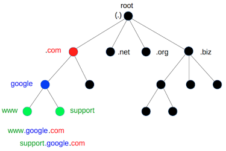
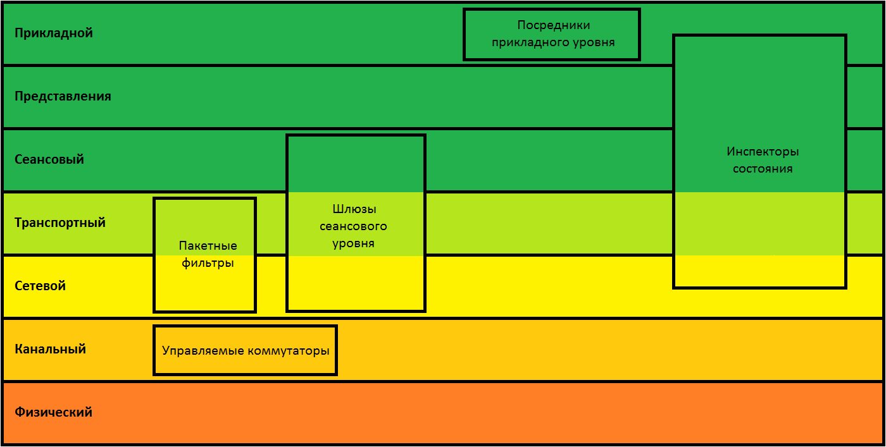

# 7. Прикладной уровень (application)

*   **Тип данных:** ...
*   **Назначение:** ...
*   **Примеры:** ...
*   **Действующие "лица"**: ...

Здесь начинается самое интересное. На этом уровне живет большая часть всего, с чем мы работаем "лицом к лицу". Приложения, с которыми мы взаимодействуем каждый день и которые можно пощупать без какой-либо подготовки, и всякие невидимые штуки, которые незаметно облегчают нашу работу в сети.Часто используемых протоколов тут очень много, поэтому я разберу несколько самых важных, а остальные просто вкратце опишу.


### DHCP (обычно, порты UDP 67 и UDP 68)

Чтобы не настраивать IP-адрес, маску сети и default gateway (шлюз) на каждом компьютере в сети вручную, можно настроить на роутере сервер DHCP (_Dynamic Host Configuration Protocol_ — протокол динамической настройки узла). Он позволяет компьютерам автоматически получать эти и некоторые другие параметры автоматически. На компьютере должна работать программа - клиент DHCP, обычно является частью операционной системы. DHCP-сервер обычно присутствует в любой сети, без него было бы тяжело, например, подключаться к WiFi в кафе или в гостях.

Слово википедии:

Протокол DHCP является клиент-серверным, то есть в его работе участвуют клиент DHCP и сервер DHCP. Передача данных производится при помощи протокола UDP. По умолчанию запросы от клиента делаются на 67 порт к серверу, сервер в свою очередь отвечает на порт 68 к клиенту, выдавая адрес IP и другую необходимую информацию, такую, как сетевую маску, шлюз по умолчанию и серверы DNS.


#### Пример процесса получения адреса

Рассмотрим пример процесса получения IP-адреса клиентом от сервера DHCP. Предположим, клиент еще не имеет собственного IP-адреса. Процесс состоит из четырех этапов.


#### Обнаружение DHCP

Вначале клиент выполняет широковещательный запрос по всей физической сети с целью обнаружить доступные DHCP-серверы. Он отправляет сообщение типа DHCPDISCOVER, при этом в качестве IP-адреса источника указывается 0.0.0.0 (так как компьютер еще не имеет собственного IP-адреса), а в качестве адреса назначения —широковещательный адрес 255.255.255.255.

Клиент заполняет несколько полей сообщения начальными значениями:


*   уникальный идентификатор транзакции, который позволяет отличать данный процесс получения IP-адреса от других, протекающих в то же время.
*   аппаратный адрес (MAC-адрес) клиента.
*   можно указать последний известный клиенту IP-адрес. Это необязательно и может быть проигнорировано сервером.

Сообщение DHCPDISCOVER может быть распространено за пределы локальной физической сети при помощи специально настроенных агентов ретрансляции DHCP, перенаправляющих поступающие от клиентов сообщения DHCP серверам в других подсетях.

Не всегда процесс получения IP адреса начинается с DHCPDISCOVER. В случае, если клиент ранее уже получал IP адрес и срок его аренды еще не прошел — клиент может пропустить стадию DHCPDISCOVER, начав с запроса DHCPREQUEST отправляемого с идентификатором сервера, который выдал адрес в прошлый раз. В случае же отсутствия ответа от DHCP сервера, выдавшего настройки в прошлый раз, клиент отправляет DHCPDISCOVER. Тем самым клиент начинает процесс получения с начала, обращаясь уже ко всем DHCP серверам в сегменте сети.


#### Предложение DHCP

Получив сообщение от клиента, сервер определяет требуемую конфигурацию клиента в соответствии с указанными сетевым администратором настройками. Сервер может выдать клиенту случайный адрес или тот, который клиент указал как "последний известный" в своем запросе. Сервер отправляет ему ответ (DHCPOFFER), в котором предлагает конфигурацию: предлагаемый клиенту IP-адрес, а также прочие параметры (такие, как адреса маршрутизаторов и DNS-серверов) в виде опций.

Это сообщение DHCP-сервер отправляет хосту, пославшему DHCPDISCOVER, на его MAC, при определенных обстоятельствах сообщение может распространяться как широковещательная рассылка. Клиент может получить несколько различных предложений DHCP от разных серверов; из них он должен выбрать то, которое его «устраивает».


#### Запрос DHCP

Выбрав одну из конфигураций, предложенных DHCP-серверами, клиент отправляет запрос DHCP (DHCPREQUEST). Он рассылается широковещательно; при этом к опциям, указанным клиентом в сообщении DHCPDISCOVER, добавляется специальная опция — идентификатор сервера — указывающая адрес DHCP-сервера, выбранного клиентом.


#### Подтверждение DHCP

Наконец, сервер подтверждает запрос и направляет это подтверждение (DHCPACK) клиенту. После этого клиент должен настроить свой сетевой интерфейс, используя предоставленные опции.

***конец вставки из википедии***

DHCP-сервер может иметь разные настройки, например диапазон адресов, из которого можно раздавать их клиентам. Еще он вынужден помнить, какому клиенту и на какой срок выдал адрес, чтобы не выдать один и тот же адрес разным клиентам. Можно выдавать адрес на длительный срок и выдавать его повторно одному и тому же клиенту, "узнавая" его по MAC. Можно вручную настроить соответствия "такому MAC - такой IP". Помимо IP-адреса, DHCP-сервер может передать клиенту IP-адрес шлюза, маску подсети, адреса DNS-серверов и имя домена DNS (про DNS позже). Правильно настроенный даже в домашней сети DHCP-сервер сильно облегчает жизнь.


### DNS  (обычно, порты UDP 53 и TCP 53)

Теперь у нас есть IP, подсеть и шлюз. Можно попробовать открыть что-нибудь в браузере. Например, google.com. Этот человекочитаемый адрес преобразуется в IP-адрес с помощью DNS (_Domain Name System_ — система доменных имен). Без него пришлось бы знать IP-адреса всех серверов и в браузере вбивать не google.com, а  80.83.240.178. Говоря по-простому, DNS - глобальная адресная книга, которая по человекочитаемому имени (которое называют **домен**) выдает IP-адрес и еще некоторую информацию. Поскольку система эта - распределенная, то есть нет единого центра, возникают некоторые сложности. Нужно не просто чтобы DNS был доступен с любого компьютера, но еще нужно как-то уметь обновлять в ней информацию, ведь сайты постоянно переезжают с сервера на сервер, доменные имена меняют владельцев и т.д.


#### Домены

Домен имеет структуру. Он разделен точками на несколько частей. Все домены можно представить в виде дерева, как на примере: 




Домен читается по частям _справа налево_: например, для домена support.google.com:


*   корневой домен "точка" который обычно не пишется, т.е. "support.google.com**.**", на картинке он в верху дерева - root.
*   "com"
*   "google"
*   "support"


#### Иерархия и запросы

Такая иерархическая структура нужна для того, чтобы по понятным правилам разделять части "базы" всех DNS-записей между странами и организациями. Не существует какого-то единого сервера DNS, который бы обрабатывал все запросы и знал бы все домены. Серверов много, и они работают в основном по такому принципу:


*   У сервера может быть зона ответственности, про которую он знает все. Например, у google есть корпоративный сервер, и на все запросы про *.google.com он умеет отвечать сам.
*   Если к серверу пришел запрос, например, про ru.wikipedia.org, и он про нее не ничего не знает, то он идет к одному из **корневых серверов** с этим же запросом. Корневой сервер отвечает: я не знаю, но знаю адрес DNS-сервера, ответственного за зону **".org"**.
*   Теперь наш сервер идет к серверу зоны .org, который аналогично перенаправляет на сервер DNS-сервер Википедии, ответственный за зону *.wikipedia.org
*   Теперь он идет к серверу Википедии, который отвечает записью про домен ru.wikipedia.org из своей базы данных.
*   Наш сервер запоминает (кэширует) на какое-то время этот ответ и уже отвечает клиенту: у ru.wikipedia.org такой-то IP адрес.
*   При повторном запросе сервер достанет эту запись из кэша, если она еще не устарела (просто по таймеру). Если она устаревает, то пропадает из кэша, и приходится повторять процесс заново.

Отсюда видно, что сервера, ответственные за более высокие уровни иерархии (зоны), могут ничего не знать про более низкие уровни (зоны), кроме адреса сервера, который ответственен за нижний уровень. Кроме того, такие сервера сами скорее всего не будут выполнять такую цепочку запросов (называемую **рекурсивный запрос**), а будут только перенаправлять на нижестоящий сервер. А вот сервера, которые ближе всего к пользователям, например в организации, университете или у провайдера, будут выполнять именно рекурсивные запросы.

Разделение зон между организациями, странами и т.д. называется **делегированием**. Когда зона переносится на отдельный DNS-сервер, на сервере родительской зоны добавляется запись со ссылкой на этот новый сервер, поэтому можно найти запись про какой-то домен, начиная поиск с корневого сервера.

DNS хранит не только IP-адреса, соответствующие доменам, но и другую информацию, нужную для работы, например, электронной почты. А еще один домен может вести на несколько IP-адресов, это полезно для балансировки нагрузки. И много доменов могут вести на один адрес, это позволяет держать несколько сайтов на одном хосте.


#### И прочее

В DNS много сложных моментов, разбирать которые без необходимости админить свой DNS-сервер смысла нет. Из интересного, что стоит знать:


*   DHCP позволяет выдать клиенту адреса DNS-серверов
*   Обычно адрес DNS-сервера выдается провайдером вместе с прочими параметрами при подключении, но использовать его необязательно.
*   Из-за того что адрес DNS-сервера - часть системных настроек, запросы к DNS бывает сложно "завернуть" в туннель
*   Компьютеры тоже кэшируют ответы от DNS-серверов на какое-то время, чтобы уменьшить нагрузку на них.
*   Три предыдущих факта вместе могут приводить к тому, что заблокированные в стране сайты остаются как бы заблокированными, даже если пытаться работать через туннель из другой страны:
    *   провайдер может выдавать адрес страницы-заглушки вместо искомого адреса
    *   компьютер может закэшировать этот ответ
    *   DNS-запросы могут не ходить через туннель и вести на заглушку провайдера
*   Поэтому часто проще всего _дома _использовать DNS-сервер google 8.8.8.8 и резервный 8.8.4.4. Для организаций лучше настроить свой собственный.
*   Можно на своем DNS-сервере настроить локальную зону и локальные имена, и ходить на известные компьютеры по именам типа "vasya", "server", "xbox" вместо IP-адресов. Вместе с хорошо настроенным DHCP можно будет вообще забыть про IP-адреса.
*   С недавнего времени DNS позволяет использовать домены на любом языке, хотя на самом деле это по-прежнему кодируется в латиницу в очень диком виде: "почта.рф" это "xn--80a1acny.xn--p1ai".
*   Долгое время домены первого уровня (типа .com .org .ru) не менялись, недавно было добавлено ОЧЕНЬ много новых: .travel .museum .aero .coffee и т.д., теперь их более 1500.
*   Домены второго уровня (vasya.ru, petya.org, google.com) можно арендовать на какой-то срок или в некоторых случаях получить бесплатно. Организации, торгующие доменами, называются **регистраторами**. Существуют сервисы, позволяющие получить домен третьего уровня бесплатно. Например, FreeDNS.
*   В операционных системах часто есть специальный файл, например в windows это c:\windows\system32\drivers\etc\hosts, а в linux /etc/hosts - в нем ищутся записи перед тем как идти к DNS-серверу. Когда-то давно DNS не было и все сетевые имена хранились в этом файле, который копировался вручную откуда-нибудь.


#### Корневые сервера

Есть 13 серверов, с которых начинается поиск доменного имени. Они администрируются разными не связанными друг с другом организациями, что позволяет говорить о том, что управление системой DNS не зависит от кого-то конкретного.


#### Dynamic DNS

Обычно конкретная запись в DNS обновляется не очень часто: при переезде сервера, при смене владельца домена, при смене настроек. Часто это делается вручную или автоматически после ручных действий. Но бывает нужно привязать домен к динамическому IP-адресу. Для этого существуют сервисы динамического DNS. Они позволяют зарегистрировать домен, и обновлять привязанный к нему IP-адрес по запросу, который можно послать автоматически. Например, если компьютер обнаружил, что у него сменился IP. Примеры таких сервисов: FreeDNS, ASUS DDNS (для владельцев роутеров ASUS).


#### Whois (обычно, порт TCP 43)

Для получения информации о доменах, IP-адресах и их владельцах существует отдельный протокол Whois ("who is?"), сервера которого обычно держат регистраторы доменных имен. Можно специальной программой-клиентом или в браузере на whois-странице любого регистратора запросить данные о любом домене: кто владелец, кто регистратор, срок аренды, контакты владельца или администратора и прочую информацию.


### HTTP (обычно, порт TCP 80)

Мы вбили в браузере google.com, узнали его IP-адрес через DNS и отправили запрос. По умолчанию браузер идет на порт TCP 80 и отправляет HTTP GET запрос. Что это? HTTP, HyperText Transfer Protocol — «протокол передачи гипертекста» — изначально протокол передачи документов в формате HTML, в настоящий момент используется для передачи произвольных данных.

Гипертекст - это идея о том, что документы могут ссылаться друг на друга. На практике это можно увидеть в HTML (HyperText Markup Language, язык разметки гипертекста): HTML-документы могут ссылаться на другие документы.

HTTP придуман для передачи текстовых или гипертекстовых документов (и любых других данных) вместе с сопутствующей информацией (например, дата создания документа, автор, размер, …). HTTP - текстовый протокол, то есть вместо "заголовок, столько-то байт, такие-то флаги" можно все сообщения читать как текст. Мало того, можно просто открыть TCP-соединение с HTTP-сервером (с помощью telnet) и руками набрать корректный HTTP-запрос. Запрос и ответ состоят из нескольких частей:


*   метод - можно считать, что это глагол, обозначающий, какое действие над документом мы хотим сделать. Их много, наиболее частые это:
    *   GET - "дай такой-то документ"
    *   HEAD - "дай только заголовки без содержимого самого документа"
    *   POST - "добавь новый документ"
    *   PUT - "запиши документ". Отличие от POST в том, что POST должен добавить новый документ, а PUT создаст новый или перезапишет существующий по данному адресу.
    *   DELETE - "удали документ такой-то"
*   адрес - имя запрашиваемого документа на сервере. Как путь до файла, но с некоторыми дополнениями. Называется URI - _Uniform Resource Identifier_, унифицированный идентификатор ресурса.
*   код ответа и пояснение - в ответе вместо адреса содержится код из трех цифр и необязательная короткая фраза, поясняющая этот код. Коды стандартизованы, фразы часто одинаковы, но бывают любыми. Известные примеры:
    *   200 OK - код ответа 200 "успех" с самоочевидным пояснением, означает что запрос успешно выполнен и ответ содержит все что было запрошено
    *   404 NOT FOUND - 404 означает что запрошенный документ не найден на сервере, и текст намекающий на это.
    *   500 INTERNAL SERVER ERROR - код 500 значит что на сервере произошла неизвестная/неожиданная ошибка.
*   версия - чаще всего это "HTTP/1.1". Существует HTTP/2, но пока он не используется повсеместно. С ним та же история, что с IPv6.
*   заголовки - это набор полей с дополнительной информацией о запросе, о клиенте, о сервере, о документе.
*   пустая строка
*   тело запроса/ответа - собственно сам документ, или ничего, например если это запрос вида "дай такой-то документ".


#### Пример запроса


```
GET / HTTP/1.1
Host: google.com
```


GET - запрос документа.

/ - адрес документа.

Дальше версия.

Строка "Host: google.com" - заголовок "Host" со значением "google.com". Позволяет веб-серверу определить, к какому сайту был запрос, если на сервере работает много разных сайтов.


#### Пример ответа


```
HTTP/1.1 200 OK
Cache-Control: private
Content-Type: text/html; charset=UTF-8
referrer-policy: no-referrer
Location: http://www.google.ru/?gfe_rd=cr&ei=1SkGWejUAqLi8Afql7XQDw
Content-Length: 258
Date: Sun, 30 Apr 2017 18:15:49 GMT

<!doctype html><html>
.....
</html>
```


Версия,

дальше 200 OK - запрос успешно обработан, вот ответ.

Дальше идут заголовки. Заголовков существует очень много для разных целей, все разбирать смысла нет, по этой теме можно учебник писать. Самое интересное здесь, пожалуй, Content-Type. Он указывает, что за содержимое содержится в теле ответа. Там может быть текст, и тогда нужно знать его кодировку, чтобы не гадать, разглядывая кракозябры, что же там такое. Там может быть картинка, или архив, или вообще любой файл, и браузеру можно с помощью этого заголовка подсказать, что это, чтобы он попробовал как-то обработать полученное. Или чтобы просто сохранил в файл без каких-либо изменений.

Дальше идет пустая строка, после которой - данные. Длина данных указана в заголовке Content-Length, поэтому браузер знает, документ получен целиком или нужно ждать, пока не скачается.


#### HTTPS  (обычно, порт TCP 443)

HTTP не предусматривает никакого шифрования, поэтому все данные, передающиеся в сети по HTTP, можно спокойно прочитать, находясь в одной локальной сети с клиентом или сервером. Для решений этой проблемы существует HTTPS - HTTP Secure, расширение HTTP, передающее данные поверх криптографических протоколов SSL или TLS. Увы, это не учебник по криптографии, поэтому даже основы объяснять будет довольно трудно: там и асимметричное шифрование, и сертификаты, и много чего еще…


#### Stateless

Очень важная особенность HTTP - отсутствие состояний. Сервер ничего не помнит о клиенте. Каждый запрос для него - как новый, и он забывает все о запросе и о клиенте после ответа. Единственный способ сохранить какую-то информацию между запросами это таскать ее с каждым запросом в заголовках. Для этого есть специальный заголовок - Cookie. Есть договоренность, что сервер вместе с ответом может отправить клиенту заголовок Set-Cookie, а клиент будет его значение отправлять со всеми последующими запросами в заголовке Cookie. Сервер может у себя в памяти с каким-то значением cookie ассоциировать клиента и отличать запросы разных клиентов друг от друга. Так работает любой сайт: если стереть cookie, то сайт "забудет" что пользователь был залогинен.


#### F12

В большинстве современных браузеров есть инструменты разработчика, чаще всего открываются по кнопке F12. Там можно посмотреть HTTP запросы и ответы (и даже вручную что-нибудь отправить), поковырять исходник страницы и много чего еще.


### FTP (обычно, порты TCP 21 и случайный TCP для передачи данных)

Один из наиболее старых протоколов - FTP - File Transfer Protocol, протокол передачи файлов. Отдаленно напоминает HTTP: клиент и сервер обмениваются текстовыми командами вида "RETR filename". Разница в том, что для передачи файлов используется отдельное TCP-соединение, и в том, что у FTP есть состояние: при подключении нужно залогиниться и сервер понимает, какие команды приходят от какого пользователя. FTP тоже ничего не шифрует и поэтому считается небезопасным. Кроме того, неправильно настроенный FTP-сервер может позволить утащить или стереть какие-нибудь ценные файлы, или просто может выдать слишком много информации о системе, что упростит дальнейший взлом. Существует защищенное расширение - FTPS (FTP Secure).


### Telnet (обычно, порт TCP 23)

Самый простой протокол и по совместительству программа-клиент с таким же названием. По сути это просто программа, которая отправляет байты с клавиатуры через TCP сокет. Telnet-сервер их принимает, и отправляет их в терминал (как если бы они были набраны в консоли с клавиатуры). Вывод терминала отправляется обратно клиенту. Можно использовать для ручной работы с другими протоколами, которые работают по TCP: просто писать вручную корректные команды. Так как Telnet предоставляет возможность запускать любой код на сервере, и никак не шифрует передаваемые данные, считается небезопасным и по умолчанию отключен практически везде.


### SSH (обычно, порт TCP 22)

Secure Shell - в мире linux-систем безопасный аналог Telnet. Предоставляет настраиваемый безопасный удаленный доступ к консоли машины, на которой запущен сервер (sshd - SSH Daemon). Поддерживает разные алгоритмы шифрования, умеет передавать файлы и является стандартом.


### RDP (обычно, порты TCP 3389 и UDP 3389)

Remote Desktop Protocol - в мире Windows стандартный протокол для подключения к удаленному рабочему столу. Есть клиенты и вроде бы даже сервера под linux. Поддерживает шифрование и разные настройки для ускорения работы (по сути передает сжатые изображения рабочего стола с порезанными цветами и частотой). Аналог - VNC.


### SMB (обычно, порт TCP 445)

Протокол, наиболее известное применение которого - "сетевые папки" в Windows. Реализация в linux называется Samba.


### POP3 (TCP 110), IMAP (TCP 143), SMTP (TCP 25, TCP 587)

Семейство почтовых протоколов. Любой почтовый сервер позволяет подключиться к нему по некоторым из этих протоколов для получения и отправки электронной почты. В последнее время многие почтовые сервисы обзавелись веб-версиями, что позволяет избавиться от проблем с настройками почтовых клиентов.


### NTP  (обычно, порт UDP 123)

Network Time Protocol - протокол, по которому синхронизируется время через интернет.


### Bittorrent (множество случайных портов TCP и UDP)

Протокол одновременного обмена данными между многими равноправными участниками, т.е. без центрального сервера. Каждый клиент одновременно является сервером, и в процессе скачивания может отдавать те данные, которые только что получил. Позволяет за короткое время распространять большие файлы среди большого количества клиентов, не требуя мощного сервера с "толстым" каналом. Используется не только пиратами для обмена фильмами, музыкой и играми, но и крупными компаниями для ускорения обновлений игр и операционных систем.


### UPnP (обычно, порт UDP 1900)

Universal Plug and Play - семейство протоколов и стандартов, направленных на возможность настройки любого устройства в сети. Полезен, например, если роутер не позволяет что-то сделать через веб-интерфейс, но поддерживает UPnP и реагирует на настройку таким образом.


### DLNA (обычно, порт UDP 1900 и случайные TCP для передачи)

Digital Living Network Alliance - семейство протоколов и стандартов для передачи мультимедиа между устройствами. Позволяет, к примеру, со смартфона показать видео на телевизоре в домашней сети, не перекачивая при этом файлы. Поддерживает хитрые штуки вроде удаленного управления и автоматического перекодирования, если приемник не поддерживает формат файла.


## Межсетевые экраны (файерволлы, firewall)

Сети и протоколы придумывались с чистого листа, и невозможно было учесть, что все это приобретет такой размах и будет использоваться повсеместно. Во многих случаях не сделано никакой защиты, и не было возможности предусмотреть все возможные виды атак. Кроме того, за всеми компьютерами, роутерами и программами не уследишь, и всегда что-то будет настроено не так. Кроме того, программы нередко содержат уязвимости, которые могут быть неизвестны пользователю и разработчику программы, но при этом эксплуатироваться злоумышленниками, в том числе по сети. Поэтому проще всего - поставить барьер на границе локальной и внешней сети. Прежде чем привести практически всю статью из википедии про файерволлы, стоит напомнить, что такое DoS-атаки. Denial of Service - это тип атак, направленных на то, чтобы оборудование или программа были завалены работой и перестали нормально функционировать и отвечать на обычные запросы. Итак, статья из википедии:

Межсетевой экран - программный или программно-аппаратный элемент компьютерной сети, осуществляющий контроль и фильтрацию проходящего через него сетевого трафика в соответствии с заданными правилами.

Фильтрация трафика осуществляется на основе набора предварительно сконфигурированных правил. Удобно представлять межсетевой экран как последовательность фильтров, обрабатывающих информационный поток. Каждый из фильтров предназначен для интерпретации отдельного правила. Последовательность правил в наборе существенно влияет на производительность межсетевого экрана. Например, многие межсетевые экраны последовательно сравнивают трафик с правилами до тех пор, пока не будет найдено соответствие. Для таких межсетевых экранов, правила, которые соответствуют наибольшему количеству трафика, следует располагать как можно выше в списке, увеличивая тем самым производительность.

Существует два принципа обработки поступающего трафика. Первый принцип гласит: «Что явно не запрещено, то разрешено». В данном случае, если межсетевой экран получил пакет, не попадающий ни под одно правило, то он передается далее. Противоположный принцип — «Что явно не разрешено, то запрещено» — гарантирует гораздо большую защищенность, так как он запрещает весь трафик, который явно не разрешен правилами. Однако, этот принцип оборачивается дополнительной нагрузкой на администратора.

В конечном счете, межсетевые экраны выполняют над поступающим трафиком одну из двух операций: пропустить пакет далее (allow) или отбросить пакет (deny). Некоторые межсетевые экраны имеют еще одну операцию — reject, при которой пакет отбрасывается, но отправителю сообщается о недоступности сервиса, доступ к которому он пытался получить (TCP RST). В противовес этому, при операции deny отправитель не информируется о недоступности сервиса, что является более безопасным.


### Классификация межсетевых экранов




Схематическое изображение классификации межсетевых экранов на основе сетевой модели OSI

До сих пор не существует единой и общепризнанной классификации межсетевых экранов. Однако в большинстве случаев поддерживаемый уровень сетевой модели OSI является основной характеристикой при их классификации. Учитывая данную модель, различают следующие типы межсетевых экранов:


*   Управляемые коммутаторы.
*   Пакетные фильтры.
*   Шлюзы сеансового уровня.
*   Посредники прикладного уровня.
*   Инспекторы состояния.


#### Управляемые коммутаторы

Управляемые коммутаторы иногда причисляют к классу межсетевых экранов, так как они осуществляют фильтрацию трафика между сетями или узлами сети. Однако они работают на канальном уровне и разделяют трафик в рамках локальной сети, а значит не могут быть использованы для обработки трафика из внешних сетей (например, из Интернета).

Многие производители сетевого оборудования, такие как Cisco, Nortel, 3Com, ZyXEL, предоставляют в своих коммутаторах возможность фильтрации трафика на основе MAC-адресов, содержащихся в заголовках фреймов. Например, в коммутаторах семейства Cisco Catalyst эта возможность реализована при помощи механизма Port Security. Однако данный метод фильтрации не является эффективным, так как аппаратно установленный в сетевой карте MAC-адрес легко меняется программным путем, поскольку значение, указанное через драйвер, имеет более высокий приоритет, чем зашитое в плату. Поэтому многие современные коммутаторы позволяют использовать другие параметры в качестве признака фильтрации — например, VLAN ID. Технология виртуальных локальных сетей (англ. Virtual Local Area Network) позволяет создавать группы хостов, трафик которых полностью изолирован от других узлов сети.

При реализации политики безопасности в рамках корпоративной сети, основу которых составляют управляемые коммутаторы, они могут быть мощным и достаточно дешевым решением. Взаимодействуя только с протоколами канального уровня, такие межсетевые экраны фильтруют трафик с очень высокой скоростью. Основным недостатком такого решения является невозможность анализа протоколов более высоких уровней.


#### Пакетные фильтры

Пакетные фильтры функционируют на сетевом уровне и контролируют прохождение трафика на основе информации, содержащейся в заголовке пакетов. Многие межсетевые экраны данного типа могут оперировать заголовками протоколов и более высокого, транспортного, уровня (например, TCP или UDP). Пакетные фильтры одними из первых появились на рынке межсетевых экранов и по сей день остаются самым распространенным их типом. Данная технология реализована в подавляющем большинстве маршрутизаторов и даже в некоторых коммутаторах.

При анализе заголовка сетевого пакета могут использоваться следующие параметры:


*   IP-адреса источника и получателя;
*   тип транспортного протокола;
*   поля служебных заголовков протоколов сетевого и транспортного уровней;
*   порт источника и получателя.

Достаточно часто приходится фильтровать фрагментированные пакеты, что затрудняет определение некоторых атак. Многие сетевые атаки используют данную уязвимость межсетевых экранов, выдавая пакеты, содержащие запрещенные данные, за фрагменты другого, доверенного пакета. Одним из способов борьбы с данным типом атак является конфигурирование межсетевого экрана таким образом, чтобы блокировать фрагментированные пакеты. Некоторые межсетевые экраны могут дефрагментировать пакеты перед пересылкой во внутреннюю сеть, но это требует дополнительных ресурсов самого межсетевого экрана, особенно памяти. Дефрагментация должна использоваться очень обоснованно, иначе такой межсетевой экран легко может сам стать жертвой DoS-атаки.

Пакетные фильтры могут быть реализованы в следующих компонентах сетевой инфраструктуры:


*   пограничные маршрутизаторы;
*   операционные системы;
*   персональные межсетевые экраны.

Так как пакетные фильтры обычно проверяют данные только в заголовках сетевого и транспортного уровней, они могут выполнять это достаточно быстро. Поэтому пакетные фильтры, встроенные в пограничные маршрутизаторы, идеальны для размещения на границе с сетью с низкой степенью доверия. Однако в пакетных фильтрах отсутствует возможность анализа протоколов более высоких уровней сетевой модели OSI. Кроме того, пакетные фильтры обычно уязвимы для атак, которые используют подделку сетевого адреса. Такие атаки обычно выполняются для обхода управления доступом, осуществляемого межсетевым экраном.


#### Шлюзы сеансового уровня

Межсетевой экран сеансового уровня исключает прямое взаимодействие внешних хостов с узлом, расположенным в локальной сети, выступая в качестве посредника (англ. proxy), который реагирует на все входящие пакеты и проверяет их допустимость на основании текущей фазы соединения. Шлюз сеансового уровня гарантирует, что ни один сетевой пакет не будет пропущен, если он не принадлежит ранее установленному соединению. Как только приходит запрос на установление соединения, в специальную таблицу помещается соответствующая информация (адреса отправителя и получателя, используемые протоколы сетевого и транспортного уровня, состояние соединения и т. д.). В случае, если соединение установлено, пакеты, передаваемые в рамках данной сессии, будут просто копироваться в локальную сеть без дополнительной фильтрации. Когда сеанс связи завершается, сведения о нем удаляются из данной таблицы. Поэтому все последующие пакеты, «притворяющиеся» пакетами уже завершенного соединения, отбрасываются.

Так как межсетевой экран данного типа исключает прямое взаимодействие между двумя узлами, шлюз сеансового уровня является единственным связующим элементом между внешней сетью и внутренними ресурсами. Это создает видимость того, что на все запросы из внешней сети отвечает шлюз, и делает практически невозможным определение топологии защищаемой сети. Кроме того, так как контакт между узлами устанавливается только при условии его допустимости, шлюз сеансового уровня предотвращает возможность реализации DoS-атаки, присущей пакетным фильтрам.

Несмотря на эффективность этой технологии, она обладает серьезным недостатком: как и у всех вышеперечисленных классов межсетевых экранов, у шлюзов сеансового уровня отсутствует возможность проверки содержания поля данных, что позволяет злоумышленнику передавать «троянских коней» в защищаемую сеть.


#### Посредники прикладного уровня

Межсетевые экраны прикладного уровня, также, как и шлюзы сеансового уровня, исключают прямое взаимодействие двух узлов. Однако, функционируя на прикладном уровне, они способны «понимать» контекст передаваемого трафика. Межсетевые экраны, реализующие эту технологию, содержат несколько приложений-посредников (англ. application proxy), каждое из которых обслуживает свой прикладной протокол. Такой межсетевой экран способен выявлять в передаваемых сообщениях и блокировать несуществующие или нежелательные последовательности команд, что зачастую означает DoS-атаку, либо запрещать использование некоторых команд (например, FTP PUT, которая дает возможность пользователю записывать информацию на FTP сервер).

Посредник прикладного уровня может определять тип передаваемой информации. Например, это позволяет заблокировать почтовое сообщение, содержащее исполняемый файл. Другой возможностью межсетевого экрана данного типа является проверка аргументов входных данных. Например, аргумент имени пользователя длиной в 100 символов либо содержащий бинарные данные является, по крайней мере, подозрительным.

Посредники прикладного уровня способны выполнять аутентификацию пользователя, а также проверять, что SSL-сертификаты подписаны конкретным центром. Межсетевые экраны прикладного уровня доступны для многих протоколов, включая HTTP, FTP, почтовые (SMTP, POP, IMAP), Telnet и другие.

Недостатками данного типа межсетевых экранов являются большие затраты времени и ресурсов на анализ каждого пакета. По этой причине они обычно не подходят для приложений реального времени. Другим недостатком является невозможность автоматического подключения поддержки новых сетевых приложений и протоколов, так как для каждого из них необходим свой агент.


#### Инспекторы состояния

Каждый из вышеперечисленных типов межсетевых экранов используется для защиты корпоративных сетей и обладает рядом преимуществ. Однако, куда эффективней было бы собрать все эти преимущества в одном устройстве и получить межсетевой экран, осуществляющий фильтрацию трафика с сетевого по прикладной уровень. Данная идея была реализована в инспекторах состояний, совмещающих в себе высокую производительность и защищенность. Данный класс межсетевых экранов позволяет контролировать:


*   каждый передаваемый пакет — на основе таблицы правил;
*   каждую сессию — на основе таблицы состояний;
*   каждое приложение — на основе разработанных посредников.

Осуществляя фильтрацию трафика по принципу шлюза сеансового уровня, данный класс межсетевых экранов не вмешивается в процесс установления соединения между узлами. Поэтому производительность инспектора состояний заметно выше, чем у посредника прикладного уровня и шлюза сеансового уровня, и сравнима с производительностью пакетных фильтров. Еще одно достоинство инспекторов состояния — прозрачность для пользователя: для клиентского программного обеспечения не потребуется дополнительная настройка. Данные межсетевые экраны имеют большие возможности расширения. При появлении новой службы или нового протокола прикладного уровня для его поддержки достаточно добавить несколько шаблонов. Однако инспекторам состояний по сравнению с посредниками прикладного уровня свойственна более низкая защищенность.

Термин инспектор состояния (англ. stateful inspection), внедренный компанией Check Point Software, полюбился производителям сетевого оборудования настолько, что сейчас практически каждый межсетевой экран причисляют к этой технологии, даже если он и не реализует ее полностью.


### Реализация

Существует два варианта исполнения межсетевых экранов — программный и программно-аппаратный. В свою очередь программно-аппаратный вариант имеет две разновидности — в виде отдельного модуля в коммутаторе или маршрутизаторе и в виде специализированного устройства.

В настоящее время чаще используется программное решение, которое на первый взгляд выглядит более привлекательным. Это вызвано тем, что для его применения достаточно, казалось бы, всего лишь приобрести программное обеспечение межсетевого экрана и установить на любой имеющийся в организации компьютер. Однако, как показывает практика, в организации далеко не всегда находится свободный компьютер, да еще и удовлетворяющий достаточно высоким требованиям по системным ресурсам. После того, как компьютер все-таки найден (чаще всего — куплен), следует процесс установки и настройки операционной системы, а также, непосредственно, программного обеспечения межсетевого экрана. Нетрудно заметить, что использование обычного персонального компьютера далеко не так просто, как может показаться. Именно поэтому все большее распространение стали получать специализированные программно-аппаратные комплексы, называемые security appliance, на основе, как правило, FreeBSD или Linux, «урезанные» для выполнения только необходимых функций. Достоинствами данных решений являются:


*   Простота внедрения: данные устройства имеют предустановленную и настроенную операционную систему и требуют минимум настроек после внедрения в сеть.
*   Простота управления: данными устройствами можно управлять откуда угодно по стандартным протоколам, таким как SNMP или Telnet, либо посредством защищенных протоколов, таких как SSH или SSL.
*   Производительность: данные устройства работают более эффективно, так как из их операционной системы исключены все неиспользуемые сервисы.
*   Отказоустойчивость и высокая доступность: данные устройства созданы выполнять конкретные задачи с высокой доступностью.


### Ограниченность анализа межсетевого экрана

Межсетевой экран позволяет осуществлять фильтрацию только того трафика, который он способен «понимать». В противном случае, он теряет свою эффективность, так как не способен осознанно принять решение о том, что делать с нераспознанным трафиком. Существуют протоколы, такие как TLS, SSH, IPsec и SRTP, использующие криптографию для того, чтобы скрыть содержимое, из-за чего их трафик не может быть проинтерпретирован. Также некоторые протоколы, такие как OpenPGP и S/MIME, шифруют данные прикладного уровня, из-за чего фильтровать трафик на основании информации, содержащейся на данном сетевом уровне, становится невозможно. Еще одним примером ограниченности анализа межсетевых экранов является туннелированный трафик, так как его фильтрация является невозможной, если межсетевой экран «не понимает» используемый механизм туннелированния. Во всех этих случаях правила, сконфигурированные на межсетевом экране, должны явно определять, что делать с трафиком, который они не могут интерпретировать.

***конец вставки из википедии***


# Навигация

- [Пролог](README.md)
- [0. Поехали](0_start.md)
- [1. Физический уровень (physical)](1_physical.md)
- [2. Канальный уровень (data link)](2_data_link.md)
- [3. Сетевой уровень (network)](3_network.md)
- [4. Транспортный уровень (transport)](4_transport.md)
- [5. Сеансовый уровень (session)](5_session.md)
- [6. Уровень представления (presentation)](6_presentation.md)
- `7. Прикладной уровень (application)`
- [8. Что осталось за кадром](8_end.md)
