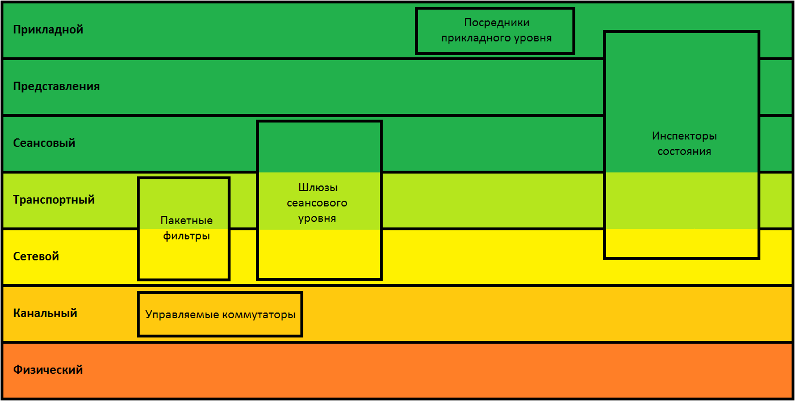

# Введение в компьютерные сети

## Пролог

Большинство онлайн-курсов про сети ориентированы на будущих админов, которые будут строить гигантскую сеть на тысячи машин в какой-нибудь корпорации. Еще в таких курсах дотошно рассматривают разные хитрые ситуации и детали. Это, конечно, полезно, но не для случая, когда надо сформировать общую картину. Разрозненные статьи из википедии и других энциклопедий не добавляют понимания для человека, который мало знаком с темой. Поэтому пришлось часть написать самостоятельно, часть взять из википедии, где это к месту. Я постарался упорядочить информацию, чтобы рассказ был более-менее последовательным, но многие вещи переплетены и взаимосвязаны, поэтому разные места будут ссылаться друг на друга, по-другому никак.

Что-то я разберу подробно, а что-то поверхностно. Почему так? Да просто исходя из своего опыта не-админа, а продвинутого пользователя, который может собрать себе домашнюю сеть не самой простой конфигурации или в большинстве ситуаций найти проблему, когда что-то не работает. Например, мне кажется важным знать в деталях, как работает TCP, чтобы отличать ситуации, когда хост закрывает соединение (посылает ответ с флагом RST) от просто “нет ответа”. А вот в точности знать, например, протокол ARP не надо, потому что я не помню чтобы с ним часто бывали проблемы. Хотя иметь общее представление стоит.


### Поехали

Сеть в нашем случае - это способ связи между компьютерами. Для обеспечения связи нужно решить много разных задач и как-то договориться, как обмениваться данными по проводам, радио и т.п., чтобы все участники сети могли принимать и отправлять информацию. Договоренность, в каком виде и в каком порядке отправлять, принимать и обрабатывать информацию - это **протокол**. Протоколов много, каждый решает какие-то свои задачи, и все сетевое взаимодействие в основном сводится к пониманию протоколов, их комбинаций и параметров. **Стэк протоколов** - комбинация, которая используется вместе для работы сети. Стэк, т.е. стопка, потому что протоколы надстроены друг над другом.

Кстати, важно заметить, что компьютерные сети в основном работают с помощью **пакетной передачи** данных, т.е. устройства по очереди обмениваются небольшими сообщениями (**пакетами**). Благодаря этому в одной сети могут общаться много участников-компьютеров. Такое разделение одной сети на нескольких участников называется **пакетной коммутацией (packet switching)**. В телефонных сетях в основном используется **канальная коммутация**, когда между двумя устройствами устанавливается канал связи (например, физически по проводу), и этот канал используется только для связи этих двух участников до конца сеанса.

Пакетная коммутация сложнее в реализации, требует цифровых устройств и поэтому появилась позже, чем канальная. Для канальной коммутации достаточно аналогового оборудования (проводные телефоны и телефонные станции), но нужно постоянно иметь много каналов связи, если нужно подключаться к разным устройствам одновременно.

Из предыдущих двух абзацев нужно запомнить, что все сетевые протоколы оперируют пакетами - небольшими кусками данных, которые могут быть отправлены разными устройствами друг другу в одной сети.

В описаниях протоколов понадобится как-то обозначать байты и биты. Бит - это просто 0 или 1, а байт можно представить по-разному:


*   как набор 8 бит, т..е двоичное число (BIN, binary), например **10101010**
*   как десятичное число (DEC, decimal) от 0 до 255, например **170**
*   как шестнадцатеричное число (HEX, hexadecimal) от 00 до FF, например **AA**

Чаще всего используются шестнадцатеричный вид, потому что байт всегда занимает два знака, и его удобнее записывать. Считать практически ничего не понадобится, поэтому не обязательно уметь складывать или конвертировать такие числа в десятичный вид, достаточно просто помнить, что шестнадцатеричные цифры - это 0123456789ABCDEF.


## OSI

Чтобы было легче ориентироваться во множестве протоколов и разрабатывать новые, есть общепринятая модель, можно сказать, классификация (как в биологии, животные-позвоночные-млекопитающие-...). **Сетевая модель OSI** (англ. _Open Systems Interconnection basic reference model_ — базовая эталонная модель взаимодействия открытых систем, сокр. **ЭМВОС**; 1978 год) — сетевая модель стека сетевых протоколов OSI/ISO (ГОСТ Р ИСО/МЭК 7498-1-99). В OSI 7 уровней - категорий, на которые условно можно разделить все протоколы. Классификация старая, не строгая, есть протоколы, которые нарушают уровни, или работают на нескольких. Но важно ее знать, потому что с ее помощью проще объяснить, как все работает _вместе_. OSI состоит из 7 уровней, причем принято начинать отсчет с нижнего:


*   7. Прикладной уровень (application layer)
*   6. Представительский уровень или уровень представления (presentation layer)
*   5. Сеансовый уровень (session layer)
*   4. Транспортный уровень (transport layer)
*   3. Сетевой уровень (network layer)
*   2. Канальный уровень (data link layer)
*   1. Физический уровень (physical layer)

Дальше будем разбираться в сетях и протоколах, последовательно с первого уровня. 


## Инкапсуляция

Для понимания всего, что будет дальше, нужно понимать идею инкапсуляции. Проще всего будет объяснить ее на примере. Предположим, мы отправляем письмо в другую страну по обычной почте.


*   Текст письма - полезные данные, которые мы хотим доставить. 
*   Мы заворачиваем письмо в конверт, который подписываем по определенным правилам - это мы используем протокол нашей местной почты.
*   Почта в свою очередь, например, грузит письмо в контейнер и тоже как-то его подписывает для доставки на самолете в другую страну - это почта использует протокол международного почтового обмена.
*   Потом в стране назначения контейнер открывают,
*   Читают что написано на конверте, и понимают, в какой город письмо отправить
*   Получатель в итоге открывает конверт и достает письмо.

Во всей этой цепочке письмо ничего не знало про конверт, а конверт ничего не знал про контейнер, их просто заворачивали целиком, а потом доставали. И никто не лез внутрь контейнера, чтобы посмотреть на текст письма. Это все вместе называется “**инкапсуляция”**. Протоколы разных уровней последовательно “завернуты” друг в друга, то есть данные, которые доставляет протокол 2-го уровня, вложены в протокол 1-го, и не зависят от него, поэтому на 1-м уровне может быть что угодно. А данные протокола 3-го уровня ничего не знают о 2-м и 1-м уровне, поэтому на 1 и 2 может быть что угодно. Как на почте: можно письмо положить в контейнер для самолета, а можно - в контейнер для корабля.


1. Физический уровень (physical)
*   **Тип данных:** биты, электрические сигналы
*   **Назначение:** работа со средой передачи (провода, радио, свет, …), сигналами и двоичными данными
*   **Примеры:** витая пара, коаксиальный кабель, оптический кабель, USB-кабель, Bluetooth, GSM, Wi-Fi
*   **Действующие “лица”**: сетевая карта, разъем, провод, радиомодем (тоже своего рода сетевая карта), хаб (hub)

Чтобы построить какую-то сеть между компьютерами, нужно как-то передавать между ними данные. Например, с помощью проводов. На этом этапе нужно договориться о **модуляции сигналов**: что считать за 0, что за 1, что за отсутствие сигнала, как отсеивать шумы и бороться с помехами. На этом уровне определяются:


*   скорость
    *   примеры для витой пары и оптики: 10 мбит, 100 мбит, 1 гбит, 10 гбит. Это свойство и сетевой карты, и кабеля. Можно иметь быструю сетевую карту и плохой/гнутый/длинный кабель, тогда сетевая карта подстроится под более низкую скорость.
    *   С WiFi несколько сложнее. Скорость зависит от поддерживаемого сетевыми картами стандарта (802.11 a/b/g/n/ac), уровня сигнал/шум, выбранных частот/каналов. Про WiFi будет отдельная глава (надеюсь).
*   тип канала
    *   дуплекс - передача может идти в обе стороны одновременно (как по телефону)
    *   полудуплекс - передача в обе стороны, но по очереди (как по рации)
    *   симплекс - передача только в одну сторону (как у ТВ-пульта, например)

Разбирать протоколы как таковые на этом уровне смысла нет, потому что обычно все это работает на аппаратной части сетевой карты и занимается преобразованием электрических/радиоволн в биты и обратно.

Из интересного, на этом уровне работают **хабы (hub)** - сетевые “раздвоители”, которые просто повторяют сигнал из одного провода в два или сразу в несколько. Хаб ничего не знает о протоколах уровней выше, об адресах, данных, просто повторяет электрические сигналы, никак их не анализируя. Из-за простоты хабов могут возникать проблемы с нагрузкой на сеть при их использовании, об этом позже. Зато хаб может быть пассивным (не требует электричества). Кстати, собрать хаб, просто скрутив провода, не получится, нужен диодный мост.


2. Канальный уровень (data link)
*   **Тип данных:** биты / кадры (фреймы)
*   **Назначение:** физическая адресация (понимать, кто с кем “общается”), разрешение коллизий (когда много участников “говорят” одновременно)
*   **Примеры:** Ethernet, PPP, DSL
*   **Действующие “лица”**: MAC-адрес,сетевая карта, коммутатор (switch)

Мы умеем передавать и принимать биты на физическом уровне. Теперь нужно научиться передавать и принимать их так, чтобы понимать, что вот этот набор бит - это чье-то сообщение, а вот этот - это незаконченный кусок сообщения (и надо получать еще биты). А еще нужно научиться разрешать ситуацию, когда несколько участников сети начинают вещать одновременно и их сообщения перекрывают друг друга (договориться о какой-то очередности). Сейчас чаще всего используется протокол Ethernet, про него и будем дальше говорить.


### Ethernet

Единица, которой оперирует Ethernet, называется **кадр, или фрейм**. Это набор байт определенной структуры, который содержит в себе полезные данные протоколов верхних уровней и служебную информацию. Существует несколько разных форматов, сейчас чаще всего используется такой:


1. Преамбула** **- 7 одинаковых байт **10101010** 
2. Начало кадра (Start of frame Delimiter) - 1 байт **10101011**
3. MAC-адрес получателя (destination) - 6 байт
4. MAC-адрес отправителя (source) - 6 байт
5. Длина - 2 байта
6. Данные - от 46 до 1500 байт (размер указан в предыдущем поле)
7. FCS (frame check sequence), контрольная сумма для проверки целостности - 4 байта

Сетевая карта при получении преамбулы и байта “начало кадра” понимает, что сейчас придет пакет (**пакет ethernet** - это все кроме преамбулы и FCS), считывает остальное (два адреса, длину, данные этой длины), вычисляет контрольную сумму по алгоритму CRC из полученного, сравнивает полученную сумму с FCS (для контроля ошибок) и если сумма совпала с FCS, то считает фрейм успешно принятым и отправляет пакет дальше в операционную систему или куда-то еще. Если значения не совпали, значит при при передаче что-то произошло: помехи, или кто-то вмешался в передачу, тогда фрейм считается поврежденным и выкидывается, а ОС вообще не знает о том, что что-либо произошло.

**MAC-адрес** (_Media Access Control_ — управление доступом к среде, также **Hardware Address**) - это комбинация из 6 байт, уникальная (ну, по задумке) для каждой единицы активного сетевого оборудования (сетевые карты, свитчи, роутеры). Обычно записывается в виде байт через двоеточия, например **F4:B7:E2:E9:4C:65**. У хабов нет MAC-адреса. Прошивается на заводе. У современного оборудования можно менять на любой. Участники сети, общающиеся с помощью Ethernet, различают друг друга по этим адресам. Сетевая карта, читающая фрейм, смотрит на поле destination, и если оно не совпадает с ее собственным адресом, выкидывает, потому что фрейм предназначается кому-то другому. Можно перевести сетевую карту в **неразборчивый (promiscuous) режим**, тогда она будет принимать все фреймы, даже не адресованные ей - это полезно при прослушивании и анализе сетевого трафика. При отправке сетевая карта пишет в поле source свой адрес. Как при отправке узнать destination, разберем позже.

Уникальность адреса при изготовлении оборудования обеспечивается тем, что производители получают в координирующем комитете IEEE Registration Authority диапазон из шестнадцати миллионов (2<sup>24</sup>) адресов, и по мере исчерпания выделенных адресов могут запросить новый диапазон. Поэтому по трем старшим (первым) байтам MAC-адреса можно определить производителя. Существуют таблицы, позволяющие определить производителя по MAC-адресу.

Есть специальный MAC-адрес **FF:FF:FF:FF:FF:FF**, который означает, что пакет предназначен всем, кто его получит (**широковещательный адрес, broadcast**). Такие пакеты нужны для работы некоторых протоколов. Об этом позже.

Ethernet придумывался во времена, когда основной средой передачи были коаксиальные кабели, рассчитанные на подключение многих устройств к одному кабелю, поэтому в него встроены технологии определения коллизий - когда два или более устройств начинают передавать данные одновременно. Это похоже на ситуацию, когда в многолюдной комнате начинают говорить сразу двое, и невозможно разобрать, что говорит каждый из них. Технология называется CSMA/CD (Carrier Sense Multiple Access with Collision Detection) и сейчас нужна в основном для ситуаций, когда на одном проводе через хаб подключено несколько компьютеров. Вкратце, сетевая карта постоянно проверяет, не передает ли кто-то данные, если нет - то передает 1 бит, снова проверяет не передал ли кто-то свои данные, передает 1 бит и т.д., если кто-то вмешался в передачу - посылает специальный сигнал, означающий обнаружение коллизии (**jam-сигнал**), засыпает на случайное время и начинает сначала. Устройства, получившие jam-сигнал, выкидывают недочитанный фрейм и ждут начала нового фрейма. Если на одном проводе подключено много устройств и все пытаются передавать данные, большую часть времени они будут проводить, сталкиваясь коллизиями и ожидая освобождения канала, поэтому рекомендуется не использовать хабы вообще.


### Коммутаторы / свитчи

На втором уровне работают коммутаторы (свитчи) - устройства, позволяющие объединить много других устройств в одну сеть без коллизий. Обычно у коммутатора десятки портов и нет настроек, хотя бывают управляемые коммутаторы, которые умеют анализировать получаемые данные и что-то с ними делать. Коммутаторы значительно быстрее роутеров в смысле передачи пакетов от устройства к устройству и вносят совсем незначительную задержку. Дальше - статья с википедии практически целиком, необязательно, но, думаю, интересно.


#### Принцип работы коммутатора

Коммутатор хранит в памяти таблицу коммутации, в которой указывается соответствие MAC-адреса узла порту коммутатора. При включении коммутатора эта таблица пуста, и он работает в режиме обучения. В этом режиме поступающие на какой-либо порт данные передаются на все остальные порты коммутатора. При этом коммутатор анализирует фреймы (кадры) и, определив MAC-адрес хоста-отправителя, заносит его в таблицу на некоторое время. Впоследствии, если на один из портов коммутатора поступит кадр, предназначенный для хоста, MAC-адрес которого уже есть в таблице, то этот кадр будет передан только через порт, указанный в таблице. Если MAC-адрес хоста-получателя не ассоциирован с каким-либо портом коммутатора, то кадр будет отправлен на все порты, за исключением того порта, с которого он был получен. Со временем коммутатор строит таблицу для всех активных MAC-адресов, в результате трафик локализуется.

Существует три способа коммутации. Каждый из них — это комбинация таких параметров, как время ожидания и надежность передачи.


#### Режимы коммутации


*   С промежуточным хранением (Store and Forward). Коммутатор читает всю информацию в кадре, проверяет его на отсутствие ошибок, выбирает порт коммутации и после этого посылает в него кадр.
*   Сквозной (cut-through). Коммутатор считывает в кадре только адрес назначения и после выполняет коммутацию. Этот режим уменьшает задержки при передаче, но в нем нет метода обнаружения ошибок.
*   Бесфрагментный (fragment-free) или гибридный. Этот режим является модификацией сквозного режима. Передача осуществляется после фильтрации фрагментов коллизий (первые 64 байта кадра анализируются на наличие ошибки и при ее отсутствии кадр обрабатывается в сквозном режиме).

Задержка, связанная с «принятием коммутатором решения», добавляется к времени, которое требуется кадру для входа на порт коммутатора и выхода с него, и вместе с ним определяет общую задержку коммутатора.


#### Симметричная и асимметричная коммутация

Свойство симметрии при коммутации позволяет дать характеристику коммутатора с точки зрения ширины полосы пропускания для каждого его порта. Симметричный коммутатор обеспечивает коммутируемые соединения между портами с одинаковой шириной полосы пропускания, например, когда все порты имеют ширину пропускания 10 Мб/с или 100 Мб/с.

Асимметричный коммутатор обеспечивает коммутируемые соединения между портами с различной шириной полосы пропускания, например, в случаях комбинации портов с шириной полосы пропускания 10 Мб/с или 100 Мб/с и 1000 Мб/с.

Асимметричная коммутация используется в случае наличия больших сетевых потоков типа клиент-сервер, когда многочисленные пользователи обмениваются информацией с сервером одновременно, что требует большей ширины пропускания для того порта коммутатора, к которому подсоединен сервер, с целью предотвращения переполнения на этом порте. Для того, чтобы направить поток данных с порта 100 Мб/с на порт 10 Мб/с без опасности переполнения на последнем, асимметричный коммутатор должен иметь буфер памяти.

Асимметричный коммутатор также необходим для обеспечения большей ширины полосы пропускания каналов между коммутаторами, осуществляемых через вертикальные кросс-соединения, или каналов между сегментами магистрали.


#### Буфер памяти

Для временного хранения фреймов и последующей их отправки по нужному адресу, коммутатор может использовать буферизацию. Буферизация может быть также использована в том случае, когда порт пункта назначения занят. Буфером называется область памяти, в которой коммутатор хранит передаваемые данные.

Буфер памяти может использовать два метода хранения и отправки фреймов: буферизация по портам и буферизация с общей памятью. При буферизации по портам пакеты хранятся в очередях (queue), которые связаны с отдельными входными портами. Пакет передается на выходной порт только тогда, когда все фреймы, находившиеся впереди него в очереди, были успешно переданы. При этом возможна ситуация, когда один фрейм задерживает всю очередь из-за занятости порта его пункта назначения. Эта задержка может происходить даже в том случае, когда остальные фреймы могут быть переданы на открытые порты их пунктов назначения.

При буферизации в общей памяти все фреймы хранятся в общем буфере памяти, который используется всеми портами коммутатора. Количество памяти, отводимой порту, определяется требуемым ему количеством. Такой метод называется динамическим распределением буферной памяти. После этого фреймы, находившиеся в буфере, динамически распределяются по выходным портам. Это позволяет получить фрейм на одном порте и отправить его с другого порта, не устанавливая его в очередь.

Коммутатор поддерживает карту портов, в которые требуется отправить фреймы. Очистка этой карты происходит только после того, как фрейм успешно отправлен.

Поскольку память буфера является общей, размер фрейма ограничивается всем размером буфера, а не долей, предназначенной для конкретного порта. Это означает, что крупные фреймы могут быть переданы с меньшими потерями, что особенно важно при асимметричной коммутации, то есть когда порт с шириной полосы пропускания 100 Мб/с должен отправлять пакеты на порт 10 Мб/с.


#### Возможности и разновидности коммутаторов

Коммутаторы подразделяются на управляемые и неуправляемые (наиболее простые).

Более сложные коммутаторы позволяют управлять коммутацией на сетевом (третьем) уровне модели OSI. Обычно их именуют соответственно, например «Layer 3 Switch» или сокращенно «L3 Switch». Управление коммутатором может осуществляться посредством Web-интерфейса, интерфейса командной строки (CLI), протоколов SNMP, RMON и т. п.

Многие управляемые коммутаторы позволяют настраивать дополнительные функции: VLAN, QoS, агрегирование, зеркалирование. Многие коммутаторы уровня доступа обладают такими расширенными возможностями, как сегментация трафика между портами, контроль трафика на предмет штормов, обнаружение петель, ограничение количества изучаемых mac-адресов, ограничение входящей/исходящей скорости на портах, функции списков доступа и т.п.

Сложные коммутаторы можно объединять в одно логическое устройство — стек — с целью увеличения числа портов. Например, можно объединить 4 коммутатора с 24 портами и получить логический коммутатор с 90 ((4*24)-6=90) портами либо с 96 портами (если для стекирования используются специальные порты).

**~~ конец вставки из википедии ~~**


### Штормы и деревья

Если соединить два порта одного свитча, или два разных свитча друг с другом (по ошибке или в сети с избыточными каналами для надежности), и послать на какой-то из портов broadcast-пакет (с адресом FF:FF:FF:FF:FF:FF), то этот пакет будет бесконечно “гоняться” в этом кольце, если следовать логике работы коммутаторов: вот пришел пакет, адрес “для всех”, отправляем всем. Он приходит обратно по кольцу, в нем адрес “для всех”, отправляем его всем. И так далее. Такие пакеты начинают лавинообразно повторяться, это называется **broadcast storm**. Для борьбы с такой ситуацией есть Spanning Tree Protocol, далее - часть статьи из википедии.


#### Spanning Tree Protocol (STP, протокол остовного дерева)

Основной задачей STP является устранение петель в топологии произвольной сети Ethernet, в которой есть один или более сетевых мостов, связанных избыточными соединениями. STP решает эту задачу, автоматически блокируя соединения, которые в данный момент для полной связности коммутаторов являются избыточными.

Необходимость устранения топологических петель в сети Ethernet следует из того, что их наличие в реальной сети Ethernet с коммутатором с высокой вероятностью приводит к бесконечным повторам передачи одних и тех же кадров Ethernet одним и более коммутатором, отчего пропускная способность сети оказывается почти полностью занятой этими бесполезными повторами; в этих условиях, хотя формально сеть может продолжать работать, на практике ее производительность становится настолько низкой, что может выглядеть как полный отказ сети.

STP относится ко второму уровню модели OSI. Протокол описан в стандарте IEEE 802.1d. STP основан на одноименном алгоритме, который разработала Радья Перлман (англ. Radia Perlman).

Если в сети с мостовыми подключениями (в сегменте сети из коммутаторов) имеется несколько путей, могут образоваться циклические маршруты, и следование простым правилам пересылки данных через мост (коммутатор) приведет к тому, что один и тот же пакет будет бесконечно передаваться с одного моста на другой (передаваться по кольцу из коммутаторов).

Алгоритм остовного дерева позволяет по мере необходимости автоматически отключать передачу через мост в отдельных портах (блокировать порты коммутатора), чтобы предотвратить зацикливание в топологии маршрутов пересылки пакетов. Для использования алгоритма остовного дерева в сетевом мосте никакой дополнительной настройки не требуется.


#### Описание

Алгоритм остовного дерева является основой протокола STP (Spanning Tree Protocol), динамически отключающего избыточные связи в сети стандарта Ethernet (для образования древовидной топологии). STP стандартизован IEEE и поддерживается многими моделями управляемых коммутаторов, в частности, включен по умолчанию на всех коммутаторах Cisco.

Суть работы протокола заключается в том, что поддерживающие его коммутаторы сети Ethernet обмениваются друг с другом информацией «о себе». На основании определенных условий (обычно в соответствии с настройками) один из коммутаторов выбирается «корневым» (или «root»), после чего все остальные коммутаторы по алгоритму остовного дерева выбирают для работы порты, «ближайшие» к «корневому» коммутатору (учитывается количество посредников и скорость линий). Все прочие сетевые порты, ведущие к «корневому» коммутатору, блокируются. Таким образом образуется несвязное дерево с корнем в выбранном коммутаторе.

В коммутаторах Cisco с поддержкой VLAN протокол STP по умолчанию выполняется независимо для каждой виртуальной сети.

Кроме STP, в коммутаторах могут применяться другие методики обнаружения и устранения петель — например, сравнением таблиц коммутации (списков MAC-адресов) разных портов, или сравнением контрольных сумм проходящих пакетов (совпадение указывает на одинаковые пакеты, которые появляются из-за петель). По сравнению с описанными методами, случайным образом (или основываясь на каких-то догадках) блокирующими «дублирующие» порты, протокол STP обеспечивает древовидную структуру всего сегмента, при любом количестве резервных линий между произвольными коммутаторами, поддерживающими STP.

**~~ конец вставки из википедии ~~**


## Топология сети

Зачем соединять устройства более чем одним проводом? Например, для избыточности - если один канал отказывает, сеть переходит на второй, и все продолжает работать. Кажется, тут уместно немного рассказать про виды сетей.


В Ethernet с использованием STP сеть автоматически превращается в дерево, причем при наличии избыточных соединений и обрыве каких-то каналов дерево само перестраивается и сеть продолжает работать (ну, по крайней мере пытается). Звезда в принципе ничем не отличается от дерева. Полностью соединенные сети встречаются редко, кольца, шины (bus) и линии использовались в прошлом, а ячеистые (mesh) сети постепенно набирают обороты в густонаселенных городах и нужны, например, для обеспечения произвольной связи без центрального провайдера.


3. Сетевой уровень (network)
*   **Тип данных:** пакеты
*   **Назначение:** определение маршрута пакета между сетями, логическая адресация
*   **Примеры: **IP v4, IP v6 
*   **Действующие “лица”**: IP-адрес, маска, маршрут, сетевая карта, маршрутизатор (роутер)

Мы умеем передавать данные от устройства к устройству, если заранее знаем MAC-адрес. Мы умеем объединять много устройств в одну сеть с помощью хаба или коммутатора. Но MAC-адрес получателя еще как-то надо узнать. И если мы соединим ОЧЕНЬ много устройств с помощью кучи коммутаторов, то нужно уметь как-то найти оптимальный (быстрый, кратчайший) маршрут, не создавая лишнюю нагрузку на сеть и не дожидаясь, пока наш пакет обойдет ее всю. Кроме того, у коммутаторов память на адреса весьма ограничена, поэтому соединить все коммутаторы и жить долго и счастливо не получится. Поэтому коммутаторы живут внутри небольших сетей, например внутри организаций, а для соединения разных сетей существуют маршрутизаторы (роутеры), они пользуются специальными протоколами и алгоритмами для построения маршрутов между сетями и определяют, куда отправлять полученные пакеты, чтобы они дошли до адресата. Использование роутеров позволяет придавать сетям структуру, сохраняя при этом связность (данные продолжают ходить куда надо). Например, чтобы послать данные на известный хост (скажем, сервер друга), не нужно знать ничего о внутренней структуре сетей, например, Ростелекома, к которым он подключен, достаточно просто иметь хотя бы один маршрут до Ростелекомовского роутера, а их роутеры дальше сами разберутся. Или вообще достаточно иметь маршрут до какого-нибудь роутера в своей сети, а роутер, если настроен на подключение к интернету, отправит пакет роутеру провайдера, который в свою очередь отправит пакет (грубо говоря) на один из центральных роутеров (**Core Routers**), они в свою очередь отправят пакет провайдеру друга, а провайдер отправит пакет уже ему на сервер. Может показаться, что существует какой-то единый центр интернета, но на самом деле существует “позвоночник” (**Internet Backbone**) - постоянно меняющееся множество государственных и частных организаций, которые обмениваются трафиком друг с другом, причем трафик может быть из какого-то географического региона, страны, континента. То есть единого центра нет, если кто-то из “позвоночника” перестанет функционировать, трафик пойдет по альтернативному маршруту через роутеры других участников, согласившихся на обмен трафиком. Максимум - отпадет крупный сегмент интернета, но он продолжит функционировать самостоятельно, как и остальной интернет будет работать без него.

Современные домашние роутеры по сути ничем не отличаются от обычных компьютеров и могут выполнять много других функций, об этом позже. Из обычного компьютера тоже можно сделать роутер, настроив на нем работу протоколов маршрутизации и подключив к нескольким сетям.

Протоколы, которые используются в internet backbone, разбирать не будем: это, например, **BGP** и **IS-IS**. Протоколы динамической маршрутизации и обмена маршрутами между роутерами нужно знать только администратору крупной сети, поэтому обойдемся и без них: это **RIPv2, OSPF, EIGRP**. Если вкратце, то маршруты “что куда посылать и почему” в роутерах не настраиваются вручную, а частично вычисляются самими роутерами и частично получаются путем обмена между роутерами, для этого и нужны эти протоколы. Руками прописываются только настройки протоколов и часть маршрутов, при необходимости. Эти же протоколы позволяют обеспечивать отказоустойчивость, когда при падении или замедлении рабочего маршрута роутеры быстро находят альтернативные маршруты через подключенных соседей.


### IP (v4)

Обеспечивает адреса в сетях, разделение сетей на независимые части и некоторые дополнительные функции. Здесь мы начинаем нарушать иерархию OSI, потому что IP чаще всего работает в связке с TCP (протокол 4 уровня) и еще мы преобразуем MAC-адреса в IP-адреса и наоборот. Части статей из википедии:

**Internet Protocol (IP, досл. «межсетевой протокол»)** — маршрутизируемый протокол сетевого уровня стека TCP/IP. Именно IP стал тем протоколом, который объединил отдельные компьютерные сети во всемирную сеть Интернет. Неотъемлемой частью протокола является адресация сети (IP-адреса).

IP объединяет сегменты сети в единую сеть, обеспечивая доставку пакетов данных между любыми узлами сети через произвольное число промежуточных узлов (маршрутизаторов). Он классифицируется как протокол третьего уровня по сетевой модели OSI. IP не гарантирует надежной доставки пакета до адресата — в частности, пакеты могут прийти не в том порядке, в котором были отправлены, продублироваться (приходят две копии одного пакета), оказаться поврежденными (обычно поврежденные пакеты уничтожаются) или не прийти вовсе. Гарантию безошибочной доставки пакетов дают некоторые протоколы более высокого уровня — транспортного уровня сетевой модели OSI, — например, TCP, которые используют IP в качестве транспорта.

В современной сети Интернет чаще всего используется IP четвертой версии, также известный как IPv4. В протоколе IP этой версии каждому узлу сети ставится в соответствие IP-адрес длиной 4 октета (4 байта). При этом компьютеры в подсетях объединяются общими начальными битами адреса. Количество этих бит, общее для данной подсети, называется маской подсети (ранее использовалось деление пространства адресов по классам — A, B, C; класс сети определялся диапазоном значений старшего октета и определял число адресуемых узлов в данной сети, сейчас используется бесклассовая адресация).

Существует еще IPv6 который разрабатывался для замены IPv4, но пока что он не используется повсеместно. Он решает многие существующие проблемы, но сложнее для понимания.

**~~ конец вставки из википедии ~~**

Про маски и прочее чуть позже, а сейчас посмотрим на структуру IP-пакета:


*   Версия - 4 бит, в IPv4 всегда 4 (0100 в двоичном виде)
*   Размер заголовка (Internet Header Length) - 4 бит, нужен из-за того что сам заголовок пакета может иметь разное число опций, и поэтому разную длину. Это число указывает на размер заголовка в 4-байтных словах (то есть, 1 означает что заголовок имеет размер 4 байта, 2 - 8 байт, и т.д.)
*   Differentiated Services Code Point (DSCP) - 6 бит, изначально называлось «тип обслуживания» (Type of Service, ToS), в настоящее время определяется как «Differentiated Services». Используется для разделения трафика на классы обслуживания, например для установки чувствительному к задержкам трафику, такому как VoIP, большего приоритета. Оборудование может обращать внимание на эти значения и менять порядок пакетов, пропуская вперед пакеты с высоким приоритетом.
*   Указатель перегрузки (Explicit Congestion Notification, ECN) - 2 бита, _Явное Уведомление о Перегруженности_. Является необязательной функцией и используется только если оба хоста ее поддерживают. Можно не заморачиваться.
*   Размер пакета - 2 байта, размер всего пакета в байтах (включая заголовок и данные), значения от 20 (заголовок без данных) до 65535.
*   Идентификатор - 2 байта. Используется, если пакет был фрагментирован (разбит на несколько пакетов поменьше). Такое бывает по разным причинам.
*   Флаги - 3 бита.
    *   не используется, всегда 0
    *   0 если пакет можно фрагментировать, 1 если нельзя
    *   0 если это последний пакет из серии фрагментов, 1 если есть еще фрагменты.
*   Смещение фрагмента - 13 бит. Указывает смещение текущего фрагмента от начала передачи фрагментированного пакета в блоках по 8 байт. Первый фрагмент в последовательности имеет нулевое смещение. Нужно для реконструкции фрагментированного содержимого пакета обратно в правильном порядке (пакеты-то могут прийти произвольно).
*   Время жизни (TTL, time to live) - 1 байт. Определяет максимальное количество маршрутизаторов на пути следования пакета. Наличие этого параметра не позволяет пакету бесконечно ходить по сети, предотвращая штормы. Каждый маршрутизатор при обработке пакета должен уменьшить значение TTL на единицу. Пакеты, время жизни которых стало равно нулю, уничтожаются, а отправителю посылается сообщение Time Exceeded по протоколу ICMP. 
*   Протокол - 1 байт. Указывает, данные какого протокола IP содержит пакет внутри (например, TCP или ICMP). Присвоенные номера протоколов можно найти на сайте IANA (сейчас их 142 штуки). Часто встречающиеся протоколы разберем позже.
*   Контрольная сумма заголовка - 2 байта. Тут число, которое сетевая карта сверит с собственной суммой, прочитав заголовок до конца. Если не совпадает, значит заголовок прочитан неправильно и пакет выбрасывается.
*   Адрес отправителя - 4 байта
*   Адрес получателя - 4 байта
*   Опции, длина переменная, используются редко, можно не заморачиваться.
*   Данные, длина переменная, в конце нет контрольной суммы, потому что целостность и проверку ошибок обеспечивают протоколы более высокого уровня, которые как раз находятся в этих данных.

Интерес здесь представляют фрагментация, TTL и собственно данные. 

Фрагментация возникает из-за того, что IP может ходить по разным сетям, и где-то под ним будет Ethernet, а где-то что-то другое, поэтому в настройках интерфейсов на роутерах есть параметр MTU (maximum transfer unit), и если пришедший IP-пакет больше чем MTU интерфейса, куда его надо переправить, роутер разбивает пакет на фрагменты. Принимающий роутер или компьютер следит за флагом фрагментации, смещением пакета и номером фрагмента, ждет пока придут все части и собирает пакет обратно, потом обрабатывает. Бывает, важно указать правильный MTU при подключении к провайдерам домашнего интернета.

TTL ограничивает количество роутеров, по которым может пройти пакет. Максимум 255. Если в сети возник цикл, пакет быстро исчерпает свой лимит и “умрет”, поэтому не возникнет бесконечного цикла или шторма. Обычное начальное значение TTL=64 (зависит от ОС).

Некоторые операторы сотовой связи запрещают использовать мобильный интернет на компьютерах, подключенных через телефон, потому что телефон играет роль роутера и уменьшает TTL на 1, поэтому оператор видит пакеты с TTL 63 (а не 64) и не пропускает их, подозревая, что их изначально отправил компьютер, а не телефон. Можно настроить телефон или компьютер так, чтобы провайдер получал пакеты с ожидаемым TTL.

Трассировка (traceroute) - инструмент сетевой диагностики, показывающий маршрут пакета в сети. Основан на отправке пакетов с разным временем жизни. Сначала отправляется пакет с TTL = 1, ближайший роутер его получает, уменьшает TTL до 0, “убивает” и в ответ посылает сообщение об этом по протоколу ICMP. Так мы узнали адрес первого роутера. Теперь отправляем пакет с TTL = 2. Первый роутер его пересылает дальше, уже с TTL = 1, следующий роутер убивает пакет и отвечает сообщением по ICMP. Теперь мы знаем адрес второго роутера. И так далее пока пакет не доберется до цели.

Поле, описывающее, что за данные несет IP-пакет, по сути нарушает модель OSI, потому что получается что “конверт” что-то знает о содержимом письма. Но это позволяет более эффективно решать некоторые задачи на роутерах.

Теперь разберем протоколы и концепции, которые тесно соседствуют с IP.


### ARP

Считается протоколом канального (2) уровня, далее выдержка из википедии:

**ARP (англ. Address Resolution Protocol — протокол определения адреса)** — протокол в компьютерных сетях, предназначенный для определения MAC-адреса по известному IP-адресу.

Рассмотрим суть функционирования ARP на простом примере. Компьютер А (IP-адрес 10.0.0.1) и компьютер Б (IP-адрес 10.22.22.2) соединены сетью Ethernet. Компьютер А желает переслать пакет данных на компьютер Б, IP-адрес компьютера Б ему известен. Однако сеть Ethernet, которой они соединены, не работает с IP-адресами. Поэтому компьютеру А для осуществления передачи через Ethernet требуется узнать адрес компьютера Б в сети Ethernet (MAC-адрес в терминах Ethernet). Для этой задачи и используется протокол ARP. По этому протоколу компьютер А отправляет широковещательный запрос, адресованный всем компьютерам в одном с ним широковещательном домене (_общий провод, хабы или коммутаторы_). Суть запроса: «компьютер с IP-адресом 10.22.22.2, сообщите свой MAC-адрес компьютеру с МАС-адресом (напр. a0:ea:d1:11:f1:01)». Сеть Ethernet доставляет этот запрос всем устройствам в том же сегменте Ethernet, в том числе и компьютеру Б. Компьютер Б отвечает компьютеру А на запрос и сообщает свой MAC-адрес (напр. 00:ea:d1:11:f1:02) Теперь, получив MAC-адрес компьютера Б, компьютер А может передавать ему любые данные через сеть Ethernet.

Наибольшее распространение ARP получил благодаря повсеместности сетей IP, построенных поверх Ethernet, поскольку практически в 100 % случаев при таком сочетании используется ARP.

**~~ конец вставки из википедии ~~**


#### Маршрутизация

Роутер по определению подключен к разным IP-сетям. Это значит, что на разных интерфейсах у него настроены разные IP-адреса, состоящие в разных подсетях. Подсеть определяется маской, об этом позже. Его интерфейсы имеют разные MAC-адреса. Когда роутер получает Ethernet-фрейм, он достает из него IP-пакет, смотрит на IP-адрес получателя, определяет по таблице маршрутизации, на какой интерфейс этот пакет отправить, заворачивает его в новый Ethernet-фрейм со своим MAC в поле source и с MAC получателя, которого он узнал с помощью ARP-запроса на нужном интерфейсе, и отправляет на этот интерфейс. И так с каждым пакетом. Таблица маршрутизации у него есть благодаря ручным настройкам и протоколам маршрутизации, MAC-адреса “соседей” он запоминает из ARP-запросов и хранит какое-то время в ARP-таблице в памяти, чтобы не заваливать сеть дурацкими вопросами.


#### Типы маршрутизации

Выше была речь про **широковещательный запрос**, или **broadcast **- когда пакет посылается на специальный адрес “для всех”. На уровне Ethernet это MAC-адрес **FF:FF:FF:FF:FF:FF**. В остальных случаях пересылка идет от одного устройства к другому, это называется **unicast**. На уровне IP есть и другие варианты. Все это - типы маршрутизации, и вообще они бывают такие:


*   **Unicast **- одному _конкретному_ получателю. Используется чаще всего.
*   **Anycast **- одному _любому_ получателю. Ближайшему или “лучшему” по какому-нибудь из параметров. Используется, например для балансировки нагрузки на корневые DNS-сервера.
*   **Broadcast **- всем получателям. Используется, например, в ARP и других протоколах для обнаружения участников. Полезно для доставки чего-то всем и сразу, но при злоупотреблении может обвалить сеть, потому что такие пакеты начинают копироваться всеми устройствами (и роутерами тоже) на все интерфейсы. То есть, и жизненно необходимо, и опасно. Поэтому в IP придуманы некоторые ограничения, чтобы такие пакеты не выходили за пределы небольшой домашней/рабочей подсети в интернет. Об этом ниже.
*   **Multicast** - группе получателей. Позволяет снизить нагрузку на сеть, отправляя данные один раз сразу всем, кто их ожидает. Например, потоковое видео, групповые звонки или конференц-связь. Все это - отдельная большая тема, нужная далеко не каждому, поэтому обойдемся без мультикаста и соответствующих протоколов. Достаточно просто знать, что такая штука существует и даже как-то работает.
*   Википедия выделяет еще **Geocast** - вид мультикаста по географическому признаку. Какой-то совсем частный случай, я с ходу даже не нашел понятных примеров, как и зачем это используется.


#### Маски

Маска вместе с IP-адресом определяют подсеть, в которой этот IP-адрес находится. Для этого нужно иметь представление о двоичном виде адреса и сравнить с маской: Например:


```
адрес 192.168.1.1
маска 255.255.255.0
```


В двоичном виде:


```
адрес 11000000 10101000 00000001 00000001
маска 11111111 11111111 11111111 00000000
```


если применить логическое (побитовое) И (AND) к адресу и маске, получим


```
 AND  11000000 10101000 00000001 00000000
или в десятичном виде 192.168.1.0
```


это адрес подсети, одинаковый для всех устройств в ней, можно сказать, имя подсети. В конце в двоичном виде остались нули, это место под адрес устройства в этой подсети, может быть любым значением. То есть, там, где в двоичном виде маски единицы - это подсеть, а где нули - это адрес устройства в подсети. Количество единиц в начале и нулей в конце позволяет менять количество возможных устройств в подсети, т.е. ее размер. В примере выше, восемь нулей в конце маски это 256 адресов устройств в подсети 192.168.1.0. Есть договоренность не использовать для устройств первый и последний адреса в подсети: первый идентифицирует саму подсеть, а последний - широковещательный (broadcast) в этой подсети. Маска может состоять только из идущих подряд единиц и нулей в конце, поэтому ее можно записывать не как 255.255.255.0, а как \24 после IP-адреса, где 24 - это количество бит-единиц в начале маски.

Вся эта фигня с масками нужна, чтобы роутеры могли определять, на каком интерфейсе нужно искать устройство-адресат, зная свой IP адрес на этом интерфейсе и маску, т.е. диапазон адресов устройств в этой подсети. А еще чтобы создавать подсети нужного размера под свои нужды при постройке сети. И еще чтобы не пропускать броадкасты в другие сети: например, броадкаст на адрес какой-нибудь широкой подсети теоретически должен бы был отправляться всем, что привело бы к обвалу сети. А зная маску, роутер пересылает броадкасты только в нужные подсети на своих интерфейсах, или не пересылает совсем.

Еще немного примеров IP с масками, на примерах обычно понять проще:

**192.168.0.42/24**


```
адрес 192.168.0.42
маска 255.255.255.0
```


В двоичном виде:


```
адрес 11000000 10101000 00000000 00101010
маска 11111111 11111111 11111111 00000000
```


если применить логическое (побитовое) И (AND) к адресу и маске, получим


```
 AND  11000000 10101000 00000000 00000000
```


или в десятичном виде **192.168.0.0** - адрес подсети

в конце маски 8 нулей, т.е. 8 последних бит в этой подсети можно менять, раздавая разным устройствам. Их адреса - от 00000001 до 11111110, то есть от .1 до .254 - 254 адреса (256 минус первый и последний).

**10.255.7.38/12**


```
адрес 10.255.7.38
маска 255.240.0.0
```


В двоичном виде:


```
адрес 00001010 11111111 00000111 00100110
маска 11111111 11110000 00000000 00000000
```


если применить логическое (побитовое) И (AND) к адресу и маске, получим


```
 AND  00001010 11110000 00000000 00000000
```


или в десятичном виде **10.240.0.0** - адрес подсети

в конце маски 20 нулей, т.е. 20 последних бит в этой подсети можно менять, раздавая разным устройствам. Их адреса - от 0000 00000000 00000001 до 1111 11111111 11111110, то есть от 10.240.0.1 до 10.255.255.254 - ‭10485754  адреса (‭10485756  минус первый и последний).

**5.6.7.8/8**


```
адрес 5.6.7.8
маска 255.0.0.0
```


В двоичном виде:


```
адрес 00000101 00000110 00000111 00001000
маска 11111111 00000000 00000000 00000000
```


если применить логическое (побитовое) И (AND) к адресу и маске, получим


```
 AND  00000101 00000000 00000000 00000000
```


или в десятичном виде **5.0.0.0** - адрес подсети

в конце маски 24 нуля, т.е. 24 последних бит в этой подсети можно менять, раздавая разным устройствам. Их адреса - от 00000000 00000000 00000001 до 11111111 11111111 11111110, то есть от .0.0.1 до .255.255.254 - 16777214 адреса (16777216 минус первый и последний).

Если роутер на своих интерфейсах имеет соседние подсети, то он может просигнализировать другим роутерам (по протоколам маршрутизации), что через него есть маршрут до более широкой подсети (с меньшей маской), т.е. для других роутеров это будет выглядеть как одна запись в таблице маршрутов. А когда ему придет пакет на эту подсеть, он уже будет определять, на какой именно интерфейс переслать, потому что у него есть более подробная информация о подсетях.


#### Немаршрутизируемые адреса

Среди всех IP-адресов есть несколько специальных диапазонов, пакеты с которыми не передаются роутерами между сетями. Такие адреса предназначены для использования в локальных сетях и называются немаршрутизируемыми.


*   10.0.0.0 — 10.255.255.255 (маска подсети 255.0.0.0 или /8)
*   172.16.0.0 — 172.31.255.255 (маска подсети 255.240.0.0 или /12)
*   192.168.0.0 — 192.168.255.255 (маска подсети 255.255.0.0 или /16)

То есть, IP-пакеты с такими адресами “ходят” только внутри локальной сети и не попадают наружу, их использование никто не контролирует, и в интернете нет хостов с такими адресами. Помимо удобства настройки (своя сеть - свои правила), это позволяет пользоваться протоколами, основанными на broadcast’ах, и они не будут выходить наружу и гулять по всей мировой сети.

Есть еще зарезервированный диапазон 224.0.0.0/4, он используется для мультивещания (multicast). Некоторые адреса из этого диапазона глобально маршрутизируемы.


#### Localhost / Loopback

Специальный диапазон 127.0.0.0 — 127.255.255.255 (маска подсети 255.0.0.0 или /8), не используется для обмена между узлами сети, пакеты с такими адресами компьютер (или роутер) перенаправляет сам себе. Полезно для использования сетевых служб запущенных на своем же компьютере, а также для тестирования.


#### Нехватка IP адресов и NAT

IP-адресов оказалось слишком мало, поэтому, вкратце, их выдают или продают небольшими блоками государствам/организациям/провайдерам, а провайдеры в свою очередь пользователям, за деньги, поэтому на каждый свой компьютер IP-адрес не купишь, кроме того, возникли бы проблемы с маршрутами, если бы компьютер или телефон с забитым в него IP-адресом переходил с места на место, потому что роутеры оперируют сетями и подсетями, и не смогут так просто найти устройство, внезапно “переехавшее” куда-то в чужую подсеть. Поэтому обычные юзеры от провайдера чаще всего получают один “белый”, т.е. нормальный маршрутизируемый IP-адрес, и роутер, который создает локальную сеть с немаршрутизируемыми адресами внутри, например, квартиры. В квартире к этой сети может быть подключено что угодно и в любом количестве, но у всех устройств будут немаршрутизируемые адреса. Роутер, который находится между провайдером и домашней сетью, из интернета выглядит как один компьютер. Когда домашние компьютеры запршивают какой-то внешний адрес, роутер в их запросах подменяет IP-адрес отправителя (из локальной сети) на свой (выданный провайдером), и запоминает, что в полученном ответе надо проделать обратную операцию, и на какой из домашних компьютеров передать ответ. Эта технология называется **NAT (network address translation)**, или иногда - **маскарад (masquerading)**. NAT бывает разных типов и с немного разным поведением, может работать и в обратную сторону (когда запрос из интернета передается в локальную сеть и потом обратно), но общая суть сохраняется - это маскировка нескольких компьютеров за одним. Эта технология вызывает боль у геймеров и у тех, кто хочет держать какой-нибудь сервер дома, потому что нужно настроить свой роутер так, чтобы входящие запросы приходили на нужный компьютер. В качестве побочного эффекта NAT защищает домашние компьютеры от всех подключений извне, что похоже на простой файерволл.


#### Default Gateway / Шлюз

Домашние роутеры обычно работают в одиночку, а клиентские устройства подключены к ним напрямую или через коммутатор. Сеть очень маленькая и простая, поэтому нет необходимости дома настраивать протоколы **динамической маршрутизации**. Чтобы устройства знали, куда отправлять IP-пакеты, когда они не предназначены локальной сети, у них есть настройка **Шлюз (default gateway)** - все пакеты, не предназначенные в локальную сеть, уходят туда, и обычно шлюзом выступает роутер, у которого в свою очередь шлюзом выступает хост провайдера. Шлюз - пример **статического маршрута**, т.е. который вручную вбит в таблицу маршрутизации (да, у всех устройств она всегда есть).

Есть протокол для автоопределения шлюза, собственного IP-адреса и маски без ручной настройки, **DHCP**, но он относится к протоколам прикладного уровня, поэтому о нем позже.


#### ICMP

Всем знакома команда ping. Чуть раньше было что-то про traceroute, который получает ответы про протоколу ICMP.

ICMP (англ. Internet Control Message Protocol — протокол межсетевых управляющих сообщений) — сетевой протокол, входящий в стек протоколов TCP/IP. В основном ICMP используется для передачи сообщений об ошибках и других исключительных ситуациях, возникших при передаче данных, например, когда хост или маршрутизатор не отвечают. Также на ICMP возлагаются некоторые сервисные функции. Хотя формально ICMP использует IP (ICMP-пакеты инкапсулируются в IP пакеты), он является неотъемлемой частью IP и обязателен при реализации стека TCP/IP.

**Ping **- программа, которая посылает IP-пакет с запросом ICMP Echo Request, и ожидает получить ответ с типом ICMP Echo Reply.

**Traceroute **отправляет пакеты, которые “умирают” на каждом хосте по пути следования, и ожидает получить ответ с типом ICMP Time Exceeded от каждого хоста, на котором пакет “умер”, поэтому в ответе будет IP-адрес хоста. Так можно отследить маршрут.

Отсутствие ICMP-ответов не всегда означает недоступность хоста или проблему с сетью, потому что ICMP протокол может быть заблокирован файерволлом.


#### VLAN

Virtual LAN - технология и несколько протоколов, встроенные в некоторые роутеры и свитчи, позволяет “держать” на одном порту несколько разных локальных подсетей одновременно, или например общую подсеть на разных портах разных роутеров/свитчей. Используется для создания сети нужной топологии, не меняя физическую топологию. Бывает еще нужно для разграничения трафика в сетях предприятий, для обеспечения безопасности и/или стабильности работы.


4. Транспортный уровень (transport)
*   **Тип данных:** сегменты, датаграммы
*   **Назначение:** прямая связь между отправителем и получателем, надежность, гарантия доставки и целостности
*   **Примеры:** TCP, UDP
*   **Действующие “лица”**: порты, сокеты, рукопожатия

Мы умеем найти нужное устройство и отправить ему пакет. Мы умеем провести пакет по нужному маршруту, чтобы он точно дошел. Но сеть может меняться, связь может пропадать, в пакетах могут меняться данные из-за помех. По разным причинам отправленные данные могут повреждаться или пропадать, приходить не в нужном порядке или не полностью. В некоторых ситуациях нам нет до этого дела, в некоторых - нам нужна гарантия того, что отправленное было доставлено в целости и сохранности. А еще нам нужно обеспечить одновременную работу кучи программ на одном устройстве (это называется **мультиплексирование**). Этим и занимаются протоколы транспортного уровня: UDP и TCP.


#### UDP

**_User Datagram Protocol._**

**Датаграмма** - блок информации, отправляемый без предварительной установки соединения и без подтверждений приема. Название было выбрано по аналогии с “телеграммой”. К слову, Ethernet и IP - тоже датаграммные протоколы, потому что работают без подтверждений и прочих механизмов.

UDP позволяет отправлять и принимать датаграммы (просто наборы байт) без проверки на то, что они будут доставлены, без проверки на порядок, дубликаты и т.д. Это работает быстро и эффективно, используется в сетевых играх и при передаче файлов, например, torrent-клиентами. Но уже само приложение должно проверять полученные данные. Почему не TCP (о котором ниже)? Потому что TCP гарантирует целостность и порядок, но может задерживать прием данных, ожидая повторной доставки потерянных пакетов, а игре проще выбросить такие данные и работать с более свежими, чем ждать пока “доедут” старые. UDP также не требует дополнительных ресурсов от отправляющего и принимающего, поэтому позволяет серверу обрабатывать запросы от огромного количества клиентов.

Структура пакета:


*   Порт отправителя - 2 байта
*   Порт получателя - 2 байта
*   Длина датаграммы - 2 байта. Длина указана для всего пакета, т.е. данные вместе с заголовком.
*   Контрольная сумма - 2 байта
*   Данные. Максимальная длина - 65527, потому что в поле “Длина” можно указать максимум 65535, минус 8 байт заголовка. Но на самом деле нет. Дело в том, что UDP завернут в IP, у которого тоже максимальная длина 65535 минус 20 байт заголовка, поэтому весь UDP должен быть не больше 65507 байт. Но на самом деле это Ethernet вообще ограничивает размер до 1500 байт. С другой стороны, это ограничение почти всегда игнорируется.

Про сам UDP больше сказать нечего. Приложение просто получает у операционной системы UDP-сокет, прибитый к порту, отправляет или получает пакеты. О портах и сокетах будет немного ниже.


#### TCP

**Transmission Control Protocol**, протокол управления передачей. TCP обеспечивает надежную передачу пакетов между хостами: гарантирует последовательность (отправленные пакеты будут приняты в том же порядке), отсутствие дублей и потерянных пакетов. Это достигается благодаря установке соединения перед началом передачи и обменом подтверждениями при приеме. Сначала посмотрим на структуру пакета, а потом разберемся зачем все это нужно и как оно работает.


*   **Source port **- 2 байта, порт отправителя
*   **Destination port **- 2 байта, порт получателя
*   **Sequence Number** - 4 байта, порядковый номер пакета в серии
*   **Acknowledgment Number **- 4 байта, номер подтверждения
*   **Длина заголовка **- 4 **бита**
*   **Зарезервировано **- 6 **бит**
*   **Флаги **- 6 **бит**: URG, ACK, PSH, RST, SYN, FIN. Если бит 1, значит соответствующий флаг установлен, если 0 то нет. Названия - сокращения от Urgent, Acknowledgement, Push, Reset, Synchronize, Final.
*   **Размер окна **- 2 байта
*   **Контрольная сумма **- 2 байта
*   **Указатель важности **- 2 байта
*   **Опции **- поле переменной длины
*   **Данные**

Про порты написано в следующем разделе.

Порядковый номер позволяет отправлять большой массив данных, разделяя их на пакеты, а потом собирать на принимающей стороне обратно в большой массив. Это делает операционная система, т.е. приложение просто пишет в TCP-сокет байты, а дальше они рассовываются по пакетам и пакеты нумеруются. При приеме таких пакетов они собираются в правильной последовательности, если какой-то пакет пришел раньше времени, то приложение его не увидит, пока не придут все пакеты перед ним.

Длина заголовка позволяет указать, внезапно, длину заголовка, чтобы можно было заполнить разное число опций в поле Опции.

Зарезервированные биты были оставлены “на потом”; два уже пригодились и используются для указания на перегрузку в сети.

Контрольная сумма позволяет проверить целостность пакета, как и в других протоколах.

Остальные поля отдельно объяснять смысла нет.


#### Порты и сокеты

На одном хосте может работать много программ, которым нужен доступ в сеть. Чтобы различать, какой IP-пакет какой программе предназначен (**мультиплексирование**), на транспортном уровне в протоколах TCP и UDP предусмотрены **порты**. Это просто двухбайтное число (0-65535) в TCP или UDP пакете, которое позволяет операционной системе раздавать программам полученные данные. Порт обычно обозначается двоеточием после IP-адреса, с припиской, TCP или UDP. Например:


*   HTTP-сервера работают на порте TCP 80. То есть  открыть страницу по адресу 216.58.211.142:80 - это то же самое, что открыть браузер и набрать там этот IP-адрес, а порт добавится по умолчанию браузером. Ну и браузер знает, что запросы надо делать по протоколу TCP.
*   Сервера Doom (1 и 2) обычно работают на портах TCP 666 и UDP 666.
*   Исходящее соединение, например открытая страница в браузере, получает у операционки случайный порт.

Программа при работе с сетью запрашивает у операционной системы разрешение работать с определенным портом, и если порт не занят кем-то другим, получает **сокет** - интерфейс для работы с сетью. По сути, это структура в памяти, созданная системой и отданная программе. Программа работает с сокетом, а дальше все делает операционная система. Программа может ждать, пока что-то придет на этот порт, и посылать ответ. Так работает любой сервер. А может послать куда-то запрос, получить ответ и закрыть сокет (освободить порт), так работают клиенты, например браузер, в простом случае.

Есть разница между клиентскими и серверными сокетами.


*   Клиентский сокет - это по сути исходящее соединение, которое определяется четырьмя параметрами: свой IP, свой (исходящий) порт, IP получателя, порт получателя. Для подключения с другого порта или на другой адрес требуется создать новый сокет.
*   Серверный сокет - это интерфейс для входящих соединений. Заранее адрес и порт клиента неизвестны. Когда программа-сервер создает такой сокет, она ждет, пока на него придет пакет. Теперь известны те же 4 параметра: свой IP, свой порт, IP отправителя, порт отправителя. Это можно представить как клиентский сокет, и начать обрабатывать пакет. Если придет пакет от клиента с другим адресом или с другого порта, это уже новая комбинация этих четырех параметров и их можно обработать, не перепутав, какой ответ потом кому направить.


#### Магия

Теперь о том, как работает TCP. Прежде чем отправить какие-то данные, TCP устанавливает **соединение**. Это такой предварительный обмен сообщениями с получателем, чтобы удостовериться что он готов к приему. Потом идут передача данных и закрытие соединения с подтверждением что все успешно принято. На стороне клиента и сервера TCP имеет состояния, по сути это - конечный автомат.

_Небольшое отступление, если что-то непонятно, то можно пропустить и не заморачиваться:_


    Конечный автомат в информатике и математике - упрощенно говоря, это такая абстракция, модель устройства, которое имеет **состояния **и при определенных условиях **переходит **из одного состояния в другое. Нас интересует то, что сеанс (соединение) TCP представляет из себя такой автомат (точнее, два автомата - по одному у отправителя и получателя) и в каждый момент времени находится в каком-то из известных состояний, и ожидает перейти в другое при получении пакетов с нужными флагами. Или по таймеру.

Список состояний сеанса TCP (алгоритмы и пояснения будут дальше):


*   **CLOSED**     Начальное состояние узла. Фактически фиктивное
*   **LISTEN**     Сервер ожидает запросов установления соединения от клиента
*   **SYN-SENT**     Клиент отправил запрос серверу на установление соединения и ожидает ответа
*   **SYN-RECEIVED**     Сервер получил запрос на соединение, отправил ответный запрос и ожидает подтверждения
*   **ESTABLISHED**     Соединение установлено, идет передача данных
*   **FIN-WAIT-1**     Одна из сторон (назовем ее узел-1) завершает соединение, отправив сегмент с флагом FIN
*   **CLOSE-WAIT     **Другая сторона (узел-2) переходит в это состояние, отправив, в свою очередь сегмент ACK и продолжает одностороннюю передачу
*   **FIN-WAIT-2     **Узел-1 получает ACK, продолжает чтение и ждет получения сегмента с флагом FIN
*   **LAST-ACK     **Узел-2 заканчивает передачу и отправляет сегмент с флагом FIN
*   **TIME-WAIT     **Узел-1 получил сегмент с флагом FIN, отправил сегмент с флагом ACK и ждет 2*(макс. время жизни сегмента) секунд, перед окончательным закрытием соединения
*   **CLOSING     **Обе стороны инициировали закрытие соединения одновременно: после отправки сегмента с флагом FIN узел-1 также получает сегмент FIN, отправляет ACK и находится в ожидании сегмента ACK (подтверждения на свой запрос о разъединении)


#### Рукопожатие

Процесс начала сеанса TCP (также называемый «рукопожатие» (англ. handshake)), состоит из трех шагов. Дальше - немного переработанные вырезки из википедии и викиучебника.


1. Узел **A** (был в состоянии CLOSED) посылает узлу **B** пакет с флагом SYN — приглашение к соединению и переходит в состояние SYN-SENT
2. **B** (был в состоянии LISTEN) получает пакет с флагом SYN, переходит в состояние SYN-RECEIVED, отвечает пакетом с флагами SYN и ACK — согласием об установлении соединения. Или он может отправить флаг RST, то есть отказ от соединения.
3. **A**, получив SYN ACK, посылает пакет ACK — подтверждение, что согласие получено и переходит в состояние ESTABLISHED. B получает этот пакет и тоже переходит в состояние ESTABLISHED. Если **A** получил RST, то он прекращает попытки соединиться с **B**. Если **A** не получил SYN ACK за несколько секунд (таймаут), он пробует сначала. Если **B** не получил ACK, то по таймауту закрывает соединение и переходит в режим CLOSED.

После этого соединение считается установленным, о чем нам говорит название состояния - ESTABLISHED - и можно передавать данные в обе стороны. «Соединение» означает, что узлы помнят друг о друге, нумеруют все пакеты, идущие в обе стороны, посылают подтверждения о получении каждого пакета и перепосылают потерявшиеся по дороге пакеты. Для узла A это соединение называется **исходящим**, а для узла B — **входящим**. Эти термины не имеют никакого отношения к входящему или исходящему трафику. Они указывают только инициатора соединения, то есть направление самого первого пакета (SYN). Любое установленное TCP соединение симметрично, и пакеты с данными по нему всегда идут в обе стороны.

Когда один из узлов решает, что пора заканчивать соединение, он посылает специальный пакет FIN, после этого узлы прощаются и разрывают соединение. Это “рукопожатие” можно перевести на человеческий язык так:


*   Эй, ты слушаешь?
*   Да / Нет
*   Ну тогда слушай. / … (нет так нет)

Процесс называется «трехэтапным рукопожатием» (англ. three way handshake), так как несмотря на то что возможен процесс установления соединения с использованием четырех сегментов (SYN в сторону сервера, ACK в сторону клиента, SYN в сторону клиента, ACK в сторону сервера), на практике для экономии времени используется три сегмента (SYN ACK в сторону клиента в одном пакете). Помимо смены состояний, TCP ведет подсчет номеров пакетов (поле в заголовке, **номер пакета**).

Вот пример соединения, в котором видно состояния, номера пакетов и флаги в них:


```
    TCP A								TCP B
   1.  CLOSED									LISTEN
   2.  SYN-SENT     → <SEQ=100><SYN>              →  SYN-RECEIVED
   3.  ESTABLISHED  ← <SEQ=300><ACK=101><SYN,ACK> ←  SYN-RECEIVED
   4.  ESTABLISHED  → <SEQ=101><ACK=301><ACK>     →   ESTABLISHED
   5.  ESTABLISHED  ← <SEQ=301><ACK=101><ACK>     ←   ESTABLISHED
```


В строке 2 TCP A начинает передачу сегмента SYN, говорящего об использовании номеров последовательности, начиная со 100. В строке 3 TCP B передает SYN и подтверждение для принятого SYN в адрес TCP A. Надо отметить, что поле подтверждения показывает ожидание TCP B приема номера последовательности 101, подтверждающего SYN с номером 100.

В строке 4 TCP A отвечает пустым сегментом с подтверждением ACK для сегмента SYN от TCP B; в строке 5 TCP B передает некоторые данные. Отметим, что номер подтверждения сегмента в строке 5 (ACK=101) совпадает с номером последовательности в строке 4 (SEQ=101), поскольку ACK не занимает пространства номеров последовательности (если это сделать, придется подтверждать подтверждения — ACK для ACK).


#### Передача данных

При обмене данными принимающий хост использует номер последовательности, содержащийся в получаемых сегментах, для восстановления их исходного порядка. Получатель уведомляет передающую сторону о номере последовательности, до которой он успешно получил данные, включая его в поле Номер подтверждения. Все получаемые данные, относящиеся к промежутку подтвержденных последовательностей, игнорируются. Если полученный сегмент содержит номер последовательности больший, чем ожидаемый, то данные из сегмента буферизируются (сохраняются во временной памяти), но номер подтвержденной последовательности не изменяется. Если впоследствии будет принят сегмент, относящийся к ожидаемому номеру последовательности, то порядок данных будет автоматически восстановлен исходя из номеров последовательностей в сегментах.

Для того, чтобы передающая сторона не отправляла данные интенсивнее, чем их может обработать приемник, TCP содержит средства управления потоком. Для этого используется поле **Размер окна**. В сегментах, направляемых от приемника передающей стороне, в поле «окно» указывается текущий размер приемного буфера. Передающая сторона сохраняет размер окна и отправляет данных не более, чем указал приемник. Если приемник указал нулевой размер окна, то передача данных в направлении этого узла не происходит, пока приемник не сообщит о большем размере окна.

В некоторых случаях передающее приложение может явно затребовать протолкнуть данные до некоторой последовательности принимающему приложению, не буферизируя их. Для этого используется флаг PSH. Если в полученном сегменте обнаруживается флаг PSH, то реализация TCP отдает все буферизированные на текущий момент данные принимающему приложению. «Проталкивание» используется, например, в интерактивных приложениях. В сетевых терминалах нет смысла ожидать ввода пользователя после того, как он закончил набирать команду. Поэтому последний сегмент, содержащий команду, обязан содержать флаг PSH, чтобы приложение на принимающей стороне смогло начать ее выполнение.

При приеме пакетов хост отвечает пакетом с подтверждением приема. Если источник не получил такой пакет за какое-то время, он считает данные не дошедшими до принимающего, и отправляет их заново. Это называется **retransmission **и повышает надежность доставки данных.


#### Закрытие соединения

Стороны могут независимо от друга захотеть закрыть соединение. Для корректного завершения сеанса используется алгоритм из четырех шагов. Почему-то он не называется “четверным рукопожатием”, хотя в английском языке так и есть: **four-way handshake termination**.


1. Когда хост, пусть **A**, решает закрыть соединение, он посылает пакет с флагом FIN и переходит в состояние FIN_WAIT_1.
2. **B** получает этот пакет, переходит в состояние CLOSE_WAIT и отвечает пакетом с флагом ACK (подтверждает). **A**, получив ACK, переходит в FIN_WAIT_2. В процессе передачи данных могли еще остаться недоставленные или неподтвержденные пакеты, поэтому он не закрывает соединение, а продолжает получать и подтверждать пакеты, ожидая “последнего слова” от **B**.
3. Когда **B** заканчивает передачу данных и получает все соответствующие ACK, он посылает FIN и переходит в состояние LAST_ACK.
4. **A** получает FIN от **B** и отправляет ему последний ACK в подтверждение. **A** после этого ждет какое-то время (2*MSL), чтобы дошли пакеты которые могли быть отправлены **B** до этого, и закрывает сокет (состояние CLOSED). **B**, получив этот ACK, тоже закрывает сокет.

Этот алгоритм гарантирует, что все данные, которые были отправлены в момент начала закрытия соединения, будут доставлены до закрытия. После перехода в состояние CLOSED операционная система считает порт освободившимся и может создать новый сокет на этом порту для другого приложения.


#### Что-то пошло не так

При нормальной работе, автоматы TCP двух участников находятся в синхронизированном состоянии. А что произойдет, если какая-то из сторон перестанет посылать пакеты, отвечать на принятые, или начнет посылать пакеты с неожиданными флагами? Например, из-за сбоя в сети, или целенаправленно, в нарушение протокола? В этом случае автоматы будут рассинхронизированы: станет непонятно, чего ожидать от очередного пакета, и что делать дальше. В таком случае соединение называется **полуоткрытым **или **полузакрытым**. В общем случае, когда TCP получает что-то неожиданное, или не получает ничего, он закрывает соединение сразу или по таймеру.

**Half-closed connection** - это соединение в процессе нормального закрытия, когда одна сторона больше не посылает данные и ожидает FIN от второй стороны. Это можно использовать для создания односторонних соединений.

**Half-open connection** - когда одна сторона закрыла соединение, а вторая и не подозревает, что что-то произошло, и ждет продолжения общения. Тут стоит рассмотреть пару интересных случаев.


#### Keep-alive

После установления TCP соединения, хосты могут бесконечно долго находиться в состоянии ESTABLISHED, то есть не происходит никаких проверок на “активность” соединения. Узнать, что что-то пошло не так, можно, только послав данные и не получив ACK в ответ. Это хорошо, потому что позволяет соединению пережить временные пропадания связи (например, выпадение провода из компьютера, или перезагрузку роутера на пути пакета). Только вот здесь кроется проблема: предположим, хост B отправил что-то хосту A. На пути пакета был роутер, и ему сбросили настройки. Пакет не дошел до A. B это понял, потому что не получил ACK за отведенное время, попробовал отправить данные несколько раз (retransmission), только вот роутер больше не знает маршрута до A, и ничего так и не дошло. B закрыл соединение и продолжил работать. Но вот A просто считает, что B ничего не отправлял и по-прежнему ждет, занимая порт.

Для решения этой проблемы существует механизм keep-alive. Сама идея простая: по таймеру посылать пакет без данных, чтобы получить в ответ ACK и таким образом удостовериться, что соединение в порядке. Keep-alive есть в TCP, но его использование необязательно. Протоколы более высоких уровней тоже могут реализовывать свой keep-alive, что тоже сводится к периодической отправке TCP-пакетов и получении подтверждений.


#### SYN-flood

Если при тройном рукопожатии послать серверу только первый SYN, и забить на дальнейшие действия, сервер ответит SYN ACK и будет ждать ответного ACK. Проблема в том, что на сервере в процессе ожидания уже будет создан сокет под это полу-открытое соединение. Если сделать много SYN-запросов, то на сервере кончатся ресурсы: память будет занята сокетами. Это называется атакой **SYN-flood**, попытка завалить сервер SYN-пакетами, чтобы у него закончились ресурсы и он не смог обрабатывать нормальные запросы.

Эта проблема решается установкой небольшого таймаута на ожидание ACK при тройном рукопожатии и ограничением количества одновременных полуоткрытых _входящих_ соединений.

В Windows (до 2008 SP2 / Vista SP2) также было ограничение на количество _исходящих _соединений, т.е. нельзя одновременно послать много SYN, для предотвращения проведения SYN-flood атак с зараженных компьютеров. Это мешало работе некоторых программ, например торрент-клиентов, потому что они активно создают и разрывают сотни соединений. Для обхода этого ограничения нужно было пропатчить драйвер tcpip.sys.


#### Больше магии? Нет, спасибо

TCP - обширная и сложная тема, там есть много интересных механизмов и ситуаций, но пока что достаточно таких базовых вещей. Пожалуй, достаточно еще знать, что TCP пытается не допускать перегрузок в сети и поэтому скорость передачи может “плавать” и какое-то время разгоняться с нуля до максимума.


5. Сеансовый уровень (session)
*   **Тип данных:** ...
*   **Назначение:** ...
*   **Примеры:** ...
*   **Действующие “лица”**: ...

Вот что говорит википедия про сеансовый уровень: _отвечает за поддержание сеанса связи, позволяя приложениям взаимодействовать между собой длительное время. Уровень управляет созданием/завершением сеанса, обменом информацией, синхронизацией задач, определением права на передачу данных и поддержанием сеанса в периоды неактивности приложений._

Не правда ли, похоже на то, чем занимается TCP/IP? Дело в том, что связка TCP/IP пришла из DoD (Department of Defense) - модель сетевого взаимодействия, разработанная Министерством Обороны США, и ее нельзя нормально классифицировать по модели OSI, хотя все это неплохо работает вместе. Просто TCP/IP вбирает в себя некоторые функции, которые предусмотрены сеансовым уровнем. И еще есть несколько протоколов, которые стоит рассмотреть здесь. Но для начала - пару слов про туннели.


### Туннели

Бывает, нужно связать компьютеры между собой, используя уже существующие сети, но защитить передаваемые данные между ними. Или сделать так, чтобы компьютеры считали себя членами одной локальной сети, при этом находясь в разных сетях и в разных местах. Для этого используется туннелирование - инкапсуляция одних сетевых протоколов в другие с целью создать одну сеть поверх другой. Для этого используются туннельные протоколы, как бы представляющие из себя туннель между участниками виртуальной сети, проложенный через существующую сеть.

Общая идея такая: пусть приложение или система думает, что отправляет пакеты на какой-то сетевой интерфейс. А этот интерфейс на самом деле не реальное устройство, а виртуальное, и проходящие через него данные обрабатываются (например, шифруются) другой программой и она уже передает пакеты через настоящий сетевой интерфейс. На стороне получателя такая же программа получает данные, расшифровывает или распаковывает их и передает в виртуальный интерфейс как будто они так и пришли. И система/приложение не замечает разницы. Договоренность, как заворачивать/зашифровывать/разворачивать/распаковывать данные в этом случае и есть туннельный протокол.


### PPTP (обычно, порт TCP 1723)

Point-to-Point Tunneling Protocol — “туннельный протокол типа точка-точка”, позволяющий компьютеру устанавливать защищенное соединение с сервером за счет создания специального туннеля в стандартной, незащищенной сети. PPTP помещает (инкапсулирует) кадры PPP (вместо Ethernet) в IP-пакеты для передачи по глобальной IP-сети, например Интернет. PPTP может также использоваться для организации туннеля между двумя локальными сетями. РРТР использует дополнительное TCP-соединение для обслуживания туннеля.

Протокол встречается при подключении к провайдерам. Предусмотрены некоторые способы шифрования, но они устарели и ненадежны.


### L2TP (обычно, порты TCP 1701 и UDP 1701)

Layer 2 Tunneling Protocol — протокол туннелирования второго уровня — в компьютерных сетях туннельный протокол, использующийся для поддержки виртуальных частных сетей. 

Тоже встречается при подключении к провайдерам. Занимается тем, что поддерживает виртуальную сеть, начиная со второго уровня OSI, поверх TCP и UDP. Сам по себе не предусматривает шифрования, поэтому поверх него обычно используется набор протоколов IPsec.


6. Уровень представления (presentation)
*   **Тип данных:** ...
*   **Назначение:** ...
*   **Примеры:** ...
*   **Действующие “лица”**: ...

По задумке архитекторов OSI, этот уровень должен был заниматься перегонкой передаваемой информации из одного формата в другой. Под “форматом” подразумевались фундаментальные различия в представлении данных между компьютерными системами разных архитектур или разных производителей. Сейчас для большинства случаев это неактуально, и либо таких различий нет, либо о них заботится само приложение, получающее или отправляющее данные. 


7. Прикладной уровень (application)
*   **Тип данных:** ...
*   **Назначение:** ...
*   **Примеры:** ...
*   **Действующие “лица”**: ...

Здесь начинается самое интересное. На этом уровне живет большая часть всего, с чем мы работаем “лицом к лицу”. Приложения, с которыми мы взаимодействуем каждый день и которые можно пощупать без какой-либо подготовки, и всякие невидимые штуки, которые незаметно облегчают нашу работу в сети.Часто используемых протоколов тут очень много, поэтому я разберу несколько самых важных, а остальные просто вкратце опишу.


### DHCP (обычно, порты UDP 67 и UDP 68)

Чтобы не настраивать IP-адрес, маску сети и default gateway (шлюз) на каждом компьютере в сети вручную, можно настроить на роутере сервер DHCP (_Dynamic Host Configuration Protocol_ — протокол динамической настройки узла). Он позволяет компьютерам автоматически получать эти и некоторые другие параметры автоматически. На компьютере должна работать программа - клиент DHCP, обычно является частью операционной системы. DHCP-сервер обычно присутствует в любой сети, без него было бы тяжело, например, подключаться к WiFi в кафе или в гостях.

Слово википедии:

Протокол DHCP является клиент-серверным, то есть в его работе участвуют клиент DHCP и сервер DHCP. Передача данных производится при помощи протокола UDP. По умолчанию запросы от клиента делаются на 67 порт к серверу, сервер в свою очередь отвечает на порт 68 к клиенту, выдавая адрес IP и другую необходимую информацию, такую, как сетевую маску, шлюз по умолчанию и серверы DNS.


#### Пример процесса получения адреса

Рассмотрим пример процесса получения IP-адреса клиентом от сервера DHCP. Предположим, клиент еще не имеет собственного IP-адреса. Процесс состоит из четырех этапов.


#### Обнаружение DHCP

Вначале клиент выполняет широковещательный запрос по всей физической сети с целью обнаружить доступные DHCP-серверы. Он отправляет сообщение типа DHCPDISCOVER, при этом в качестве IP-адреса источника указывается 0.0.0.0 (так как компьютер еще не имеет собственного IP-адреса), а в качестве адреса назначения —широковещательный адрес 255.255.255.255.

Клиент заполняет несколько полей сообщения начальными значениями:


*   уникальный идентификатор транзакции, который позволяет отличать данный процесс получения IP-адреса от других, протекающих в то же время.
*   аппаратный адрес (MAC-адрес) клиента.
*   можно указать последний известный клиенту IP-адрес. Это необязательно и может быть проигнорировано сервером.

Сообщение DHCPDISCOVER может быть распространено за пределы локальной физической сети при помощи специально настроенных агентов ретрансляции DHCP, перенаправляющих поступающие от клиентов сообщения DHCP серверам в других подсетях.

Не всегда процесс получения IP адреса начинается с DHCPDISCOVER. В случае, если клиент ранее уже получал IP адрес и срок его аренды еще не прошел — клиент может пропустить стадию DHCPDISCOVER, начав с запроса DHCPREQUEST отправляемого с идентификатором сервера, который выдал адрес в прошлый раз. В случае же отсутствия ответа от DHCP сервера, выдавшего настройки в прошлый раз, клиент отправляет DHCPDISCOVER. Тем самым клиент начинает процесс получения с начала, обращаясь уже ко всем DHCP серверам в сегменте сети.


#### Предложение DHCP

Получив сообщение от клиента, сервер определяет требуемую конфигурацию клиента в соответствии с указанными сетевым администратором настройками. Сервер может выдать клиенту случайный адрес или тот, который клиент указал как “последний известный” в своем запросе. Сервер отправляет ему ответ (DHCPOFFER), в котором предлагает конфигурацию: предлагаемый клиенту IP-адрес, а также прочие параметры (такие, как адреса маршрутизаторов и DNS-серверов) в виде опций.

Это сообщение DHCP-сервер отправляет хосту, пославшему DHCPDISCOVER, на его MAC, при определенных обстоятельствах сообщение может распространяться как широковещательная рассылка. Клиент может получить несколько различных предложений DHCP от разных серверов; из них он должен выбрать то, которое его «устраивает».


#### Запрос DHCP

Выбрав одну из конфигураций, предложенных DHCP-серверами, клиент отправляет запрос DHCP (DHCPREQUEST). Он рассылается широковещательно; при этом к опциям, указанным клиентом в сообщении DHCPDISCOVER, добавляется специальная опция — идентификатор сервера — указывающая адрес DHCP-сервера, выбранного клиентом.


#### Подтверждение DHCP

Наконец, сервер подтверждает запрос и направляет это подтверждение (DHCPACK) клиенту. После этого клиент должен настроить свой сетевой интерфейс, используя предоставленные опции.

**~~ конец вставки из википедии ~~**

DHCP-сервер может иметь разные настройки, например диапазон адресов, из которого можно раздавать их клиентам. Еще он вынужден помнить, какому клиенту и на какой срок выдал адрес, чтобы не выдать один и тот же адрес разным клиентам. Можно выдавать адрес на длительный срок и выдавать его повторно одному и тому же клиенту, “узнавая” его по MAC. Можно вручную настроить соответствия “такому MAC - такой IP”. Помимо IP-адреса, DHCP-сервер может передать клиенту IP-адрес шлюза, маску подсети, адреса DNS-серверов и имя домена DNS (про DNS позже). Правильно настроенный даже в домашней сети DHCP-сервер сильно облегчает жизнь.


### DNS  (обычно, порты UDP 53 и TCP 53)

Теперь у нас есть IP, подсеть и шлюз. Можно попробовать открыть что-нибудь в браузере. Например, google.com. Этот человекочитаемый адрес преобразуется в IP-адрес с помощью DNS (_Domain Name System_ — система доменных имен). Без него пришлось бы знать IP-адреса всех серверов и в браузере вбивать не google.com, а  80.83.240.178. Говоря по-простому, DNS - глобальная адресная книга, которая по человекочитаемому имени (которое называют **домен**) выдает IP-адрес и еще некоторую информацию. Поскольку система эта - распределенная, то есть нет единого центра, возникают некоторые сложности. Нужно не просто чтобы DNS был доступен с любого компьютера, но еще нужно как-то уметь обновлять в ней информацию, ведь сайты постоянно переезжают с сервера на сервер, доменные имена меняют владельцев и т.д.


#### Домены

Домен имеет структуру. Он разделен точками на несколько частей. Все домены можно представить в виде дерева, как на примере: 


Домен читается по частям _справа налево_: например, для домена support.google.com:


*   корневой домен “точка” который обычно не пишется, т.е. “support.google.com**.”,** на картинке он в верху дерева - root.
*   “com”
*   “google”
*   “support”


#### Иерархия и запросы

Такая иерархическая структура нужна для того, чтобы по понятным правилам разделять части “базы” всех DNS-записей между странами и организациями. Не существует какого-то единого сервера DNS, который бы обрабатывал все запросы и знал бы все домены. Серверов много, и они работают в основном по такому принципу:


*   У сервера может быть зона ответственности, про которую он знает все. Например, у google есть корпоративный сервер, и на все запросы про *.google.com он умеет отвечать сам.
*   Если к серверу пришел запрос, например, про ru.wikipedia.org, и он про нее не ничего не знает, то он идет к одному из **корневых серверов** с этим же запросом. Корневой сервер отвечает: я не знаю, но знаю адрес DNS-сервера, ответственного за зону **“.org”**.
*   Теперь наш сервер идет к серверу зоны .org, который аналогично перенаправляет на сервер DNS-сервер Википедии, ответственный за зону *.wikipedia.org
*   Теперь он идет к серверу Википедии, который отвечает записью про домен ru.wikipedia.org из своей базы данных.
*   Наш сервер запоминает (кэширует) на какое-то время этот ответ и уже отвечает клиенту: у ru.wikipedia.org такой-то IP адрес.
*   При повторном запросе сервер достанет эту запись из кэша, если она еще не устарела (просто по таймеру). Если она устаревает, то пропадает из кэша, и приходится повторять процесс заново.

Отсюда видно, что сервера, ответственные за более высокие уровни иерархии (зоны), могут ничего не знать про более низкие уровни (зоны), кроме адреса сервера, который ответственен за нижний уровень. Кроме того, такие сервера сами скорее всего не будут выполнять такую цепочку запросов (называемую **рекурсивный запрос**), а будут только перенаправлять на нижестоящий сервер. А вот сервера, которые ближе всего к пользователям, например в организации, университете или у провайдера, будут выполнять именно рекурсивные запросы.

Разделение зон между организациями, странами и т.д. называется **делегированием**. Когда зона переносится на отдельный DNS-сервер, на сервере родительской зоны добавляется запись со ссылкой на этот новый сервер, поэтому можно найти запись про какой-то домен, начиная поиск с корневого сервера.

DNS хранит не только IP-адреса, соответствующие доменам, но и другую информацию, нужную для работы, например, электронной почты. А еще один домен может вести на несколько IP-адресов, это полезно для балансировки нагрузки. И много доменов могут вести на один адрес, это позволяет держать несколько сайтов на одном хосте.


#### И прочее

В DNS много сложных моментов, разбирать которые без необходимости админить свой DNS-сервер смысла нет. Из интересного, что стоит знать:


*   DHCP позволяет выдать клиенту адреса DNS-серверов
*   Обычно адрес DNS-сервера выдается провайдером вместе с прочими параметрами при подключении, но использовать его необязательно.
*   Из-за того что адрес DNS-сервера - часть системных настроек, запросы к DNS бывает сложно “завернуть” в туннель
*   Компьютеры тоже кэшируют ответы от DNS-серверов на какое-то время, чтобы уменьшить нагрузку на них.
*   Три предыдущих факта вместе могут приводить к тому, что заблокированные в стране сайты остаются как бы заблокированными, даже если пытаться работать через туннель из другой страны:
    *   провайдер может выдавать адрес страницы-заглушки вместо искомого адреса
    *   компьютер может закэшировать этот ответ
    *   DNS-запросы могут не ходить через туннель и вести на заглушку провайдера
*   Поэтому часто проще всего _дома _использовать DNS-сервер google 8.8.8.8 и резервный 8.8.4.4. Для организаций лучше настроить свой собственный.
*   Можно на своем DNS-сервере настроить локальную зону и локальные имена, и ходить на известные компьютеры по именам типа “vasya”, “server”, “xbox” вместо IP-адресов. Вместе с хорошо настроенным DHCP можно будет вообще забыть про IP-адреса.
*   С недавнего времени DNS позволяет использовать домены на любом языке, хотя на самом деле это по-прежнему кодируется в латиницу в очень диком виде: “почта.рф” это “xn--80a1acny.xn--p1ai”.
*   Долгое время домены первого уровня (типа .com .org .ru) не менялись, недавно было добавлено ОЧЕНЬ много новых: .travel .museum .aero .coffee и т.д., теперь их более 1500.
*   Домены второго уровня (vasya.ru, petya.org, google.com) можно арендовать на какой-то срок или в некоторых случаях получить бесплатно. Организации, торгующие доменами, называются **регистраторами**. Существуют сервисы, позволяющие получить домен третьего уровня бесплатно. Например, FreeDNS.
*   В операционных системах часто есть специальный файл, например в windows это c:\windows\system32\drivers\etc\hosts, а в linux /etc/hosts - в нем ищутся записи перед тем как идти к DNS-серверу. Когда-то давно DNS не было и все сетевые имена хранились в этом файле, который копировался вручную откуда-нибудь.


#### Корневые сервера

Есть 13 серверов, с которых начинается поиск доменного имени. Они администрируются разными не связанными друг с другом организациями, что позволяет говорить о том, что управление системой DNS не зависит от кого-то конкретного.


#### Dynamic DNS

Обычно конкретная запись в DNS обновляется не очень часто: при переезде сервера, при смене владельца домена, при смене настроек. Часто это делается вручную или автоматически после ручных действий. Но бывает нужно привязать домен к динамическому IP-адресу. Для этого существуют сервисы динамического DNS. Они позволяют зарегистрировать домен, и обновлять привязанный к нему IP-адрес по запросу, который можно послать автоматически. Например, если компьютер обнаружил, что у него сменился IP. Примеры таких сервисов: FreeDNS, ASUS DDNS (для владельцев роутеров ASUS).


#### Whois (обычно, порт TCP 43)

Для получения информации о доменах, IP-адресах и их владельцах существует отдельный протокол Whois (“who is?”), сервера которого обычно держат регистраторы доменных имен. Можно специальной программой-клиентом или в браузере на whois-странице любого регистратора запросить данные о любом домене: кто владелец, кто регистратор, срок аренды, контакты владельца или администратора и прочую информацию.


### HTTP (обычно, порт TCP 80)

Мы вбили в браузере google.com, узнали его IP-адрес через DNS и отправили запрос. По умолчанию браузер идет на порт TCP 80 и отправляет HTTP GET запрос. Что это? HTTP, HyperText Transfer Protocol — «протокол передачи гипертекста» — изначально протокол передачи документов в формате HTML, в настоящий момент используется для передачи произвольных данных.

Гипертекст - это идея о том, что документы могут ссылаться друг на друга. На практике это можно увидеть в HTML (HyperText Markup Language, язык разметки гипертекста): HTML-документы могут ссылаться на другие документы.

HTTP придуман для передачи текстовых или гипертекстовых документов (и любых других данных) вместе с сопутствующей информацией (например, дата создания документа, автор, размер, …). HTTP - текстовый протокол, то есть вместо “заголовок, столько-то байт, такие-то флаги” можно все сообщения читать как текст. Мало того, можно просто открыть TCP-соединение с HTTP-сервером (с помощью telnet) и руками набрать корректный HTTP-запрос. Запрос и ответ состоят из нескольких частей:


*   метод - можно считать, что это глагол, обозначающий, какое действие над документом мы хотим сделать. Их много, наиболее частые это:
    *   GET - “дай такой-то документ”
    *   HEAD - “дай только заголовки без содержимого самого документа”
    *   POST - “добавь новый документ”
    *   PUT - “запиши документ”. Отличие от POST в том, что POST должен добавить новый документ, а PUT создаст новый или перезапишет существующий по данному адресу.
    *   DELETE - “удали документ такой-то”
*   адрес - имя запрашиваемого документа на сервере. Как путь до файла, но с некоторыми дополнениями. Называется URI - _Uniform Resource Identifier_, унифицированный идентификатор ресурса.
*   код ответа и пояснение - в ответе вместо адреса содержится код из трех цифр и необязательная короткая фраза, поясняющая этот код. Коды стандартизованы, фразы часто одинаковы, но бывают любыми. Известные примеры:
    *   200 OK - код ответа 200 “успех” с самоочевидным пояснением, означает что запрос успешно выполнен и ответ содержит все что было запрошено
    *   404 NOT FOUND - 404 означает что запрошенный документ не найден на сервере, и текст намекающий на это.
    *   500 INTERNAL SERVER ERROR - код 500 значит что на сервере произошла неизвестная/неожиданная ошибка.
*   версия - чаще всего это “HTTP/1.1”. Существует HTTP/2, но пока он не используется повсеместно. С ним та же история, что с IPv6.
*   заголовки - это набор полей с дополнительной информацией о запросе, о клиенте, о сервере, о документе.
*   пустая строка
*   тело запроса/ответа - собственно сам документ, или ничего, например если это запрос вида “дай такой-то документ”.


#### Пример запроса


```
GET / HTTP/1.1
Host: google.com
```


GET - запрос документа.

/ - адрес документа.

Дальше версия.

Строка “Host: google.com” - заголовок “Host” со значением “google.com”. Позволяет веб-серверу определить, к какому сайту был запрос, если на сервере работает много разных сайтов.


#### Пример ответа


```
HTTP/1.1 200 OK
Cache-Control: private
Content-Type: text/html; charset=UTF-8
referrer-policy: no-referrer
Location: http://www.google.ru/?gfe_rd=cr&ei=1SkGWejUAqLi8Afql7XQDw
Content-Length: 258
Date: Sun, 30 Apr 2017 18:15:49 GMT

<!doctype html><html>
.....
</html>
```


Версия,

дальше 200 OK - запрос успешно обработан, вот ответ.

Дальше идут заголовки. Заголовков существует очень много для разных целей, все разбирать смысла нет, по этой теме можно учебник писать. Самое интересное здесь, пожалуй, Content-Type. Он указывает, что за содержимое содержится в теле ответа. Там может быть текст, и тогда нужно знать его кодировку, чтобы не гадать, разглядывая кракозябры, что же там такое. Там может быть картинка, или архив, или вообще любой файл, и браузеру можно с помощью этого заголовка подсказать, что это, чтобы он попробовал как-то обработать полученное. Или чтобы просто сохранил в файл без каких-либо изменений.

Дальше идет пустая строка, после которой - данные. Длина данных указана в заголовке Content-Length, поэтому браузер знает, документ получен целиком или нужно ждать, пока не скачается.


#### HTTPS  (обычно, порт TCP 443)

HTTP не предусматривает никакого шифрования, поэтому все данные, передающиеся в сети по HTTP, можно спокойно прочитать, находясь в одной локальной сети с клиентом или сервером. Для решений этой проблемы существует HTTPS - HTTP Secure, расширение HTTP, передающее данные поверх криптографических протоколов SSL или TLS. Увы, это не учебник по криптографии, поэтому даже основы объяснять будет довольно трудно: там и асимметричное шифрование, и сертификаты, и много чего еще…


#### Stateless

Очень важная особенность HTTP - отсутствие состояний. Сервер ничего не помнит о клиенте. Каждый запрос для него - как новый, и он забывает все о запросе и о клиенте после ответа. Единственный способ сохранить какую-то информацию между запросами это таскать ее с каждым запросом в заголовках. Для этого есть специальный заголовок - Cookie. Есть договоренность, что сервер вместе с ответом может отправить клиенту заголовок Set-Cookie, а клиент будет его значение отправлять со всеми последующими запросами в заголовке Cookie. Сервер может у себя в памяти с каким-то значением cookie ассоциировать клиента и отличать запросы разных клиентов друг от друга. Так работает любой сайт: если стереть cookie, то сайт “забудет” что пользователь был залогинен.


#### F12

В большинстве современных браузеров есть инструменты разработчика, чаще всего открываются по кнопке F12. Там можно посмотреть HTTP запросы и ответы (и даже вручную что-нибудь отправить), поковырять исходник страницы и много чего еще.


### FTP (обычно, порты TCP 21 и случайный TCP для передачи данных)

Один из наиболее старых протоколов - FTP - File Transfer Protocol, протокол передачи файлов. Отдаленно напоминает HTTP: клиент и сервер обмениваются текстовыми командами вида “RETR filename”. Разница в том, что для передачи файлов используется отдельное TCP-соединение, и в том, что у FTP есть состояние: при подключении нужно залогиниться и сервер понимает, какие команды приходят от какого пользователя. FTP тоже ничего не шифрует и поэтому считается небезопасным. Кроме того, неправильно настроенный FTP-сервер может позволить утащить или стереть какие-нибудь ценные файлы, или просто может выдать слишком много информации о системе, что упростит дальнейший взлом. Существует защищенное расширение - FTPS (FTP Secure).


### Telnet (обычно, порт TCP 23)

Самый простой протокол и по совместительству программа-клиент с таким же названием. По сути это просто программа, которая отправляет байты с клавиатуры через TCP сокет. Telnet-сервер их принимает, и отправляет их в терминал (как если бы они были набраны в консоли с клавиатуры). Вывод терминала отправляется обратно клиенту. Можно использовать для ручной работы с другими протоколами, которые работают по TCP: просто писать вручную корректные команды. Так как Telnet предоставляет возможность запускать любой код на сервере, и никак не шифрует передаваемые данные, считается небезопасным и по умолчанию отключен практически везде.


### SSH (обычно, порт TCP 22)

Secure Shell - в мире linux-систем безопасный аналог Telnet. Предоставляет настраиваемый безопасный удаленный доступ к консоли машины, на которой запущен сервер (sshd - SSH Daemon). Поддерживает разные алгоритмы шифрования, умеет передавать файлы и является стандартом.


### RDP (обычно, порты TCP 3389 и UDP 3389)

Remote Desktop Protocol - в мире Windows стандартный протокол для подключения к удаленному рабочему столу. Есть клиенты и вроде бы даже сервера под linux. Поддерживает шифрование и разные настройки для ускорения работы (по сути передает сжатые изображения рабочего стола с порезанными цветами и частотой). Аналог - VNC.


### SMB (обычно, порт TCP 445)

Протокол, наиболее известное применение которого - “сетевые папки” в Windows. Реализация в linux называется Samba.


### POP3 (TCP 110), IMAP (TCP 143), SMTP (TCP 25, TCP 587)

Семейство почтовых протоколов. Любой почтовый сервер позволяет подключиться к нему по некоторым из этих протоколов для получения и отправки электронной почты. В последнее время многие почтовые сервисы обзавелись веб-версиями, что позволяет избавиться от проблем с настройками почтовых клиентов.


### NTP  (обычно, порт UDP 123)

Network Time Protocol - протокол, по которому синхронизируется время через интернет.


### Bittorrent (множество случайных портов TCP и UDP)

Протокол одновременного обмена данными между многими равноправными участниками, т.е. без центрального сервера. Каждый клиент одновременно является сервером, и в процессе скачивания может отдавать те данные, которые только что получил. Позволяет за короткое время распространять большие файлы среди большого количества клиентов, не требуя мощного сервера с “толстым” каналом. Используется не только пиратами для обмена фильмами, музыкой и играми, но и крупными компаниями для ускорения обновлений игр и операционных систем.


### UPnP (обычно, порт UDP 1900)

Universal Plug and Play - семейство протоколов и стандартов, направленных на возможность настройки любого устройства в сети. Полезен, например, если роутер не позволяет что-то сделать через веб-интерфейс, но поддерживает UPnP и реагирует на настройку таким образом.


### DLNA (обычно, порт UDP 1900 и случайные TCP для передачи)

Digital Living Network Alliance - семейство протоколов и стандартов для передачи мультимедиа между устройствами. Позволяет, к примеру, со смартфона показать видео на телевизоре в домашней сети, не перекачивая при этом файлы. Поддерживает хитрые штуки вроде удаленного управления и автоматического перекодирования, если приемник не поддерживает формат файла.


## Межсетевые экраны (файерволлы, firewall)

Сети и протоколы придумывались с чистого листа, и невозможно было учесть, что все это приобретет такой размах и будет использоваться повсеместно. Во многих случаях не сделано никакой защиты, и не было возможности предусмотреть все возможные виды атак. Кроме того, за всеми компьютерами, роутерами и программами не уследишь, и всегда что-то будет настроено не так. Кроме того, программы нередко содержат уязвимости, которые могут быть неизвестны пользователю и разработчику программы, но при этом эксплуатироваться злоумышленниками, в том числе по сети. Поэтому проще всего - поставить барьер на границе локальной и внешней сети. Прежде чем привести практически всю статью из википедии про файерволлы, стоит напомнить, что такое DoS-атаки. Denial of Service - это тип атак, направленных на то, чтобы оборудование или программа были завалены работой и перестали нормально функционировать и отвечать на обычные запросы. Итак, статья из википедии:

Межсетевой экран - программный или программно-аппаратный элемент компьютерной сети, осуществляющий контроль и фильтрацию проходящего через него сетевого трафика в соответствии с заданными правилами.

Фильтрация трафика осуществляется на основе набора предварительно сконфигурированных правил. Удобно представлять межсетевой экран как последовательность фильтров, обрабатывающих информационный поток. Каждый из фильтров предназначен для интерпретации отдельного правила. Последовательность правил в наборе существенно влияет на производительность межсетевого экрана. Например, многие межсетевые экраны последовательно сравнивают трафик с правилами до тех пор, пока не будет найдено соответствие. Для таких межсетевых экранов, правила, которые соответствуют наибольшему количеству трафика, следует располагать как можно выше в списке, увеличивая тем самым производительность.

Существует два принципа обработки поступающего трафика. Первый принцип гласит: «Что явно не запрещено, то разрешено». В данном случае, если межсетевой экран получил пакет, не попадающий ни под одно правило, то он передается далее. Противоположный принцип — «Что явно не разрешено, то запрещено» — гарантирует гораздо большую защищенность, так как он запрещает весь трафик, который явно не разрешен правилами. Однако, этот принцип оборачивается дополнительной нагрузкой на администратора.

В конечном счете, межсетевые экраны выполняют над поступающим трафиком одну из двух операций: пропустить пакет далее (allow) или отбросить пакет (deny). Некоторые межсетевые экраны имеют еще одну операцию — reject, при которой пакет отбрасывается, но отправителю сообщается о недоступности сервиса, доступ к которому он пытался получить (TCP RST). В противовес этому, при операции deny отправитель не информируется о недоступности сервиса, что является более безопасным.


### Классификация межсетевых экранов




Схематическое изображение классификации межсетевых экранов на основе сетевой модели OSI

До сих пор не существует единой и общепризнанной классификации межсетевых экранов. Однако в большинстве случаев поддерживаемый уровень сетевой модели OSI является основной характеристикой при их классификации. Учитывая данную модель, различают следующие типы межсетевых экранов:


*   Управляемые коммутаторы.
*   Пакетные фильтры.
*   Шлюзы сеансового уровня.
*   Посредники прикладного уровня.
*   Инспекторы состояния.


#### Управляемые коммутаторы

Управляемые коммутаторы иногда причисляют к классу межсетевых экранов, так как они осуществляют фильтрацию трафика между сетями или узлами сети. Однако они работают на канальном уровне и разделяют трафик в рамках локальной сети, а значит не могут быть использованы для обработки трафика из внешних сетей (например, из Интернета).

Многие производители сетевого оборудования, такие как Cisco, Nortel, 3Com, ZyXEL, предоставляют в своих коммутаторах возможность фильтрации трафика на основе MAC-адресов, содержащихся в заголовках фреймов. Например, в коммутаторах семейства Cisco Catalyst эта возможность реализована при помощи механизма Port Security. Однако данный метод фильтрации не является эффективным, так как аппаратно установленный в сетевой карте MAC-адрес легко меняется программным путем, поскольку значение, указанное через драйвер, имеет более высокий приоритет, чем зашитое в плату. Поэтому многие современные коммутаторы позволяют использовать другие параметры в качестве признака фильтрации — например, VLAN ID. Технология виртуальных локальных сетей (англ. Virtual Local Area Network) позволяет создавать группы хостов, трафик которых полностью изолирован от других узлов сети.

При реализации политики безопасности в рамках корпоративной сети, основу которых составляют управляемые коммутаторы, они могут быть мощным и достаточно дешевым решением. Взаимодействуя только с протоколами канального уровня, такие межсетевые экраны фильтруют трафик с очень высокой скоростью. Основным недостатком такого решения является невозможность анализа протоколов более высоких уровней.


#### Пакетные фильтры

Пакетные фильтры функционируют на сетевом уровне и контролируют прохождение трафика на основе информации, содержащейся в заголовке пакетов. Многие межсетевые экраны данного типа могут оперировать заголовками протоколов и более высокого, транспортного, уровня (например, TCP или UDP). Пакетные фильтры одними из первых появились на рынке межсетевых экранов и по сей день остаются самым распространенным их типом. Данная технология реализована в подавляющем большинстве маршрутизаторов и даже в некоторых коммутаторах.

При анализе заголовка сетевого пакета могут использоваться следующие параметры:


*   IP-адреса источника и получателя;
*   тип транспортного протокола;
*   поля служебных заголовков протоколов сетевого и транспортного уровней;
*   порт источника и получателя.

Достаточно часто приходится фильтровать фрагментированные пакеты, что затрудняет определение некоторых атак. Многие сетевые атаки используют данную уязвимость межсетевых экранов, выдавая пакеты, содержащие запрещенные данные, за фрагменты другого, доверенного пакета. Одним из способов борьбы с данным типом атак является конфигурирование межсетевого экрана таким образом, чтобы блокировать фрагментированные пакеты. Некоторые межсетевые экраны могут дефрагментировать пакеты перед пересылкой во внутреннюю сеть, но это требует дополнительных ресурсов самого межсетевого экрана, особенно памяти. Дефрагментация должна использоваться очень обоснованно, иначе такой межсетевой экран легко может сам стать жертвой DoS-атаки.

Пакетные фильтры могут быть реализованы в следующих компонентах сетевой инфраструктуры:


*   пограничные маршрутизаторы;
*   операционные системы;
*   персональные межсетевые экраны.

Так как пакетные фильтры обычно проверяют данные только в заголовках сетевого и транспортного уровней, они могут выполнять это достаточно быстро. Поэтому пакетные фильтры, встроенные в пограничные маршрутизаторы, идеальны для размещения на границе с сетью с низкой степенью доверия. Однако в пакетных фильтрах отсутствует возможность анализа протоколов более высоких уровней сетевой модели OSI. Кроме того, пакетные фильтры обычно уязвимы для атак, которые используют подделку сетевого адреса. Такие атаки обычно выполняются для обхода управления доступом, осуществляемого межсетевым экраном.


#### Шлюзы сеансового уровня

Межсетевой экран сеансового уровня исключает прямое взаимодействие внешних хостов с узлом, расположенным в локальной сети, выступая в качестве посредника (англ. proxy), который реагирует на все входящие пакеты и проверяет их допустимость на основании текущей фазы соединения. Шлюз сеансового уровня гарантирует, что ни один сетевой пакет не будет пропущен, если он не принадлежит ранее установленному соединению. Как только приходит запрос на установление соединения, в специальную таблицу помещается соответствующая информация (адреса отправителя и получателя, используемые протоколы сетевого и транспортного уровня, состояние соединения и т. д.). В случае, если соединение установлено, пакеты, передаваемые в рамках данной сессии, будут просто копироваться в локальную сеть без дополнительной фильтрации. Когда сеанс связи завершается, сведения о нем удаляются из данной таблицы. Поэтому все последующие пакеты, «притворяющиеся» пакетами уже завершенного соединения, отбрасываются.

Так как межсетевой экран данного типа исключает прямое взаимодействие между двумя узлами, шлюз сеансового уровня является единственным связующим элементом между внешней сетью и внутренними ресурсами. Это создает видимость того, что на все запросы из внешней сети отвечает шлюз, и делает практически невозможным определение топологии защищаемой сети. Кроме того, так как контакт между узлами устанавливается только при условии его допустимости, шлюз сеансового уровня предотвращает возможность реализации DoS-атаки, присущей пакетным фильтрам.

Несмотря на эффективность этой технологии, она обладает серьезным недостатком: как и у всех вышеперечисленных классов межсетевых экранов, у шлюзов сеансового уровня отсутствует возможность проверки содержания поля данных, что позволяет злоумышленнику передавать «троянских коней» в защищаемую сеть.


#### Посредники прикладного уровня

Межсетевые экраны прикладного уровня, также, как и шлюзы сеансового уровня, исключают прямое взаимодействие двух узлов. Однако, функционируя на прикладном уровне, они способны «понимать» контекст передаваемого трафика. Межсетевые экраны, реализующие эту технологию, содержат несколько приложений-посредников (англ. application proxy), каждое из которых обслуживает свой прикладной протокол. Такой межсетевой экран способен выявлять в передаваемых сообщениях и блокировать несуществующие или нежелательные последовательности команд, что зачастую означает DoS-атаку, либо запрещать использование некоторых команд (например, FTP PUT, которая дает возможность пользователю записывать информацию на FTP сервер).

Посредник прикладного уровня может определять тип передаваемой информации. Например, это позволяет заблокировать почтовое сообщение, содержащее исполняемый файл. Другой возможностью межсетевого экрана данного типа является проверка аргументов входных данных. Например, аргумент имени пользователя длиной в 100 символов либо содержащий бинарные данные является, по крайней мере, подозрительным.

Посредники прикладного уровня способны выполнять аутентификацию пользователя, а также проверять, что SSL-сертификаты подписаны конкретным центром. Межсетевые экраны прикладного уровня доступны для многих протоколов, включая HTTP, FTP, почтовые (SMTP, POP, IMAP), Telnet и другие.

Недостатками данного типа межсетевых экранов являются большие затраты времени и ресурсов на анализ каждого пакета. По этой причине они обычно не подходят для приложений реального времени. Другим недостатком является невозможность автоматического подключения поддержки новых сетевых приложений и протоколов, так как для каждого из них необходим свой агент.


#### Инспекторы состояния

Каждый из вышеперечисленных типов межсетевых экранов используется для защиты корпоративных сетей и обладает рядом преимуществ. Однако, куда эффективней было бы собрать все эти преимущества в одном устройстве и получить межсетевой экран, осуществляющий фильтрацию трафика с сетевого по прикладной уровень. Данная идея была реализована в инспекторах состояний, совмещающих в себе высокую производительность и защищенность. Данный класс межсетевых экранов позволяет контролировать:


*   каждый передаваемый пакет — на основе таблицы правил;
*   каждую сессию — на основе таблицы состояний;
*   каждое приложение — на основе разработанных посредников.

Осуществляя фильтрацию трафика по принципу шлюза сеансового уровня, данный класс межсетевых экранов не вмешивается в процесс установления соединения между узлами. Поэтому производительность инспектора состояний заметно выше, чем у посредника прикладного уровня и шлюза сеансового уровня, и сравнима с производительностью пакетных фильтров. Еще одно достоинство инспекторов состояния — прозрачность для пользователя: для клиентского программного обеспечения не потребуется дополнительная настройка. Данные межсетевые экраны имеют большие возможности расширения. При появлении новой службы или нового протокола прикладного уровня для его поддержки достаточно добавить несколько шаблонов. Однако инспекторам состояний по сравнению с посредниками прикладного уровня свойственна более низкая защищенность.

Термин инспектор состояния (англ. stateful inspection), внедренный компанией Check Point Software, полюбился производителям сетевого оборудования настолько, что сейчас практически каждый межсетевой экран причисляют к этой технологии, даже если он и не реализует ее полностью.


### Реализация

Существует два варианта исполнения межсетевых экранов — программный и программно-аппаратный. В свою очередь программно-аппаратный вариант имеет две разновидности — в виде отдельного модуля в коммутаторе или маршрутизаторе и в виде специализированного устройства.

В настоящее время чаще используется программное решение, которое на первый взгляд выглядит более привлекательным. Это вызвано тем, что для его применения достаточно, казалось бы, всего лишь приобрести программное обеспечение межсетевого экрана и установить на любой имеющийся в организации компьютер. Однако, как показывает практика, в организации далеко не всегда находится свободный компьютер, да еще и удовлетворяющий достаточно высоким требованиям по системным ресурсам. После того, как компьютер все-таки найден (чаще всего — куплен), следует процесс установки и настройки операционной системы, а также, непосредственно, программного обеспечения межсетевого экрана. Нетрудно заметить, что использование обычного персонального компьютера далеко не так просто, как может показаться. Именно поэтому все большее распространение стали получать специализированные программно-аппаратные комплексы, называемые security appliance, на основе, как правило, FreeBSD или Linux, «урезанные» для выполнения только необходимых функций. Достоинствами данных решений являются:


*   Простота внедрения: данные устройства имеют предустановленную и настроенную операционную систему и требуют минимум настроек после внедрения в сеть.
*   Простота управления: данными устройствами можно управлять откуда угодно по стандартным протоколам, таким как SNMP или Telnet, либо посредством защищенных протоколов, таких как SSH или SSL.
*   Производительность: данные устройства работают более эффективно, так как из их операционной системы исключены все неиспользуемые сервисы.
*   Отказоустойчивость и высокая доступность: данные устройства созданы выполнять конкретные задачи с высокой доступностью.


### Ограниченность анализа межсетевого экрана

Межсетевой экран позволяет осуществлять фильтрацию только того трафика, который он способен «понимать». В противном случае, он теряет свою эффективность, так как не способен осознанно принять решение о том, что делать с нераспознанным трафиком. Существуют протоколы, такие как TLS, SSH, IPsec и SRTP, использующие криптографию для того, чтобы скрыть содержимое, из-за чего их трафик не может быть проинтерпретирован. Также некоторые протоколы, такие как OpenPGP и S/MIME, шифруют данные прикладного уровня, из-за чего фильтровать трафик на основании информации, содержащейся на данном сетевом уровне, становится невозможно. Еще одним примером ограниченности анализа межсетевых экранов является туннелированный трафик, так как его фильтрация является невозможной, если межсетевой экран «не понимает» используемый механизм туннелированния. Во всех этих случаях правила, сконфигурированные на межсетевом экране, должны явно определять, что делать с трафиком, который они не могут интерпретировать.

**~~ конец вставки из википедии ~~**


## Что осталось за кадром

Беспроводные сети. Известные атаки на протоколы и защита. Криптография, используемая в HTTPS и SSH. Организация большой и надежной сети. VPN. Примеры команд. Примеры настроек файерволлов. Инструменты для работы с конкретными протоколами и для работы с трафиком вообще. Про что-то есть отдельные детальные мануалы, в чем-то надо разбираться конкретно в зависимости от задачи. Не то чтобы это все было необходимо для настройки и понимания сетей, но если начал разбираться, становится трудно остановиться. Надеюсь, этот текст помог составить общую картину, сразу с некоторыми важными деталями.


# Credits:


*   Rast1234
*   Kiban, ради него все и было написано и собрано в единый мануал
*   Википедия, Викиучебник
*   Stackoverflow, Serverfault
*   Чьи-то случайные блоги
*   Курсы в ургу и ведущие их люди: Cisco, Интернет, Perl, Web и HTML
*   Команда Hackerdom и организаторы RuCTF/RuCTFe
*   Те, кто согласился оставить свои комментарии на полях: Vovanz, Mikle, Izokina, Ardmannas, anonymous

<!-- Docs to Markdown version 1.0β18 -->
